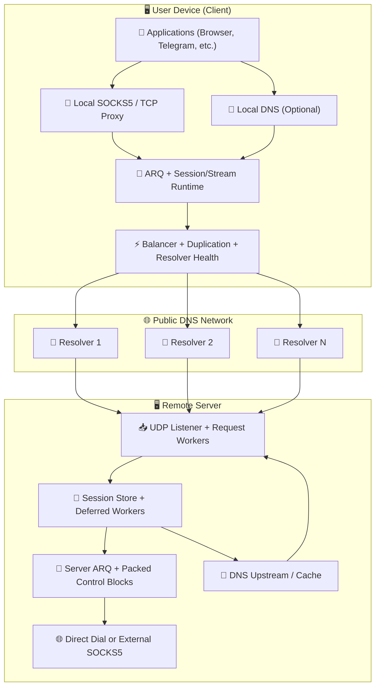
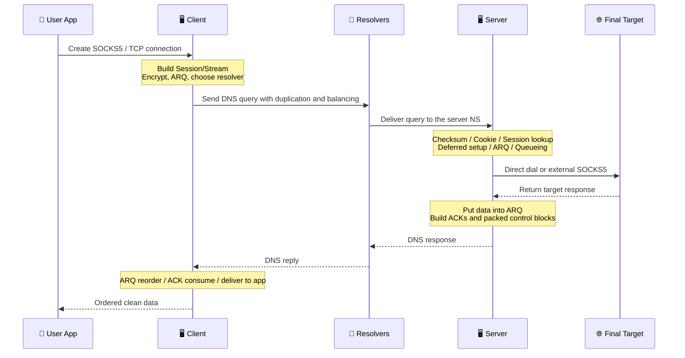

# MasterDnsVPN Project 🔐

## | 🇮🇷 [فارسی](https://github.com/masterking32/MasterDnsVPN/blob/main/README_FA.MD) | 🇬🇧 [English](https://github.com/masterking32/MasterDnsVPN/blob/main/README.MD) | 🇷🇺 [Русский](https://github.com/masterking32/MasterDnsVPN/blob/main/README_RU.MD) | 🇨🇳 [中文](https://github.com/masterking32/MasterDnsVPN/blob/main/README_ZH.MD) | 🇪🇸 [Español](https://github.com/masterking32/MasterDnsVPN/blob/main/README_ES.MD) | 🇮🇹 [Italiano](https://github.com/masterking32/MasterDnsVPN/blob/main/README_IT.MD) |

**MasterDnsVPN** is a scientific and research-oriented project for carrying TCP traffic through DNS queries and responses. In broad goal, it is similar to projects such as DNSTT or SlipStream, but it follows a fundamentally different structure and implementation approach.
This system is designed around compatibility with many resolver behaviors and harsh network conditions, with the goal of preserving the highest possible stability and data delivery even in the worst cases.

[](https://deepwiki.com/masterking32/MasterDnsVPN)
[](https://oosmetrics.com/achievement/5c7b2ce0-0af6-4648-8ded-fd1e847096cd)
[](https://oosmetrics.com/achievement/355e590f-9b4a-4015-bb8c-a7f27b721711)
[](https://oosmetrics.com/achievement/4b98a42e-bf63-4f55-a382-0f10359a5e20)

<a href="https://trendshift.io/repositories/23688" target="_blank"></a>

### 📊 MasterDnsVPN Compared with Similar Projects

| Feature | SlipStream | DNSTT | MasterDnsVPN |
| :--- | :--- | :--- | :--- |
| Protocol type | Advanced DNS tunnel | Classic DNS tunnel | Advanced DNS tunnel / VPN |
| Transport protocol | QUIC | KCP + Noise | Custom protocol + ARQ |
| Transport header overhead | 🟠 ~24B | 🔴 ~59B | 🟢 ~5–7B<br>≈88% lower than DNSTT<br>≈71% lower than SlipStream |
| Encryption style | TLS 1.3 (inside QUIC) | Noise (Curve25519) | AES / ChaCha20 / XOR (if XOR is used: lightweight with lower security and no extra overhead) |
| Architecture | Unified (QUIC handles everything) | Multi-layered (KCP + SMUX + Noise) | 🟢 Lightweight custom design optimized for DNS |
| Speed | 🟡 High (up to ~5× faster than DNSTT) | 🔴 Medium | 🟢 Faster than others<br>Up to ~9× faster than DNSTT<br>Up to ~3.6× faster than SlipStream |
| Stability under packet loss | 🟡 Good | 🟠 Medium | 🟢 Very high (Multipath + ARQ) |
| Multi-resolver support | Yes (multipath) | ❌ | Yes — advanced (multi-resolver + duplication) |
| Resilience under heavy censorship | Good | Medium | Very strong (a core project goal) |
| Setup complexity | Medium | Simple | Easier installation<br>More complex only if you heavily customize advanced settings |
| SOCKS5 support | Yes | Yes | Optimized for SOCKS5 / SOCKS4 with reduced SOCKS overhead |
| Shadowsocks support | ✅ | ❌ | Indirectly: TCP Forwarding mode can carry TCP-based protocols<br>e.g. Shadowsocks, VLESS/VMess, etc. |
| Real multipath | Yes (QUIC multipath) | ❌ | Yes (multi-resolver + duplication) |
| Adaptive routing | Limited | ❌ | Advanced (latency/loss based) |
| Design goal | High speed and efficiency | Simplicity and stability | Surviving the harshest networks — stability, speed, and efficiency |
| Implementation language | Rust | Go | Main version is Go<br>Legacy Python version also exists |
| Built-in balancer | 🔴 | ❌ | 🟢 (8 built-in balancing modes) |
| Duplication system | ❌ | ❌ | Yes — increases traffic to improve reliability (configurable or can be disabled) |
| MTU tolerance | Better than DNSTT | - | Works even with very small MTU because protocol overhead is very low |
| Failover system | ❌ | ❌ | ✅ |
| Download speed 10MB (Local) | 🟡 0.978s | 🔴 2.492s | 🟢 0.270s |
| Upload speed 10MB (Local) | 🟡 3.249s | 🔴 16.207s | 🟢 1.746s |
| Resolver health checks and auto-disable | ❌ | ❌ | ✅ |
| Background reactivation of healthy resolvers | ❌ | ❌ | ✅ |
| Local DNS service on client (to reduce DNS hijacking) | ❌ | ❌ | ✅ (with strong DNS caching) |
| DNS resolving through SOCKS5 | ❌ | ❌ | ✅ (with DNS caching) |
| Fine-grained professional configuration | 🟠 | 🟠 | 🟢 Almost every subsystem is configurable |
| No external helper software required | ❌ | ❌ | 🟢 No extra software is required; if needed, you can still combine it with SOCKS or tools such as Shadowsocks or OpenVPN |

---

### ❌ Disclaimer

MasterDnsVPN is provided as an educational and research project only.

- **Provided without warranty:** This software is provided “AS-IS”, without any express or implied warranty, including merchantability, fitness for a particular purpose, or non-infringement.
- **Limitation of liability:** The developers and contributors of this project accept no responsibility for any direct, indirect, incidental, consequential, or other damages arising from the use of this software or the inability to use it.
- **User responsibility:** Using this project outside test environments may disrupt or damage network behavior. The user alone is responsible for all consequences of installation, configuration, and use.
- **Legal compliance:** Using this project to bypass local laws may result in civil or criminal consequences. Please review the laws and regulations of your country before use. The developers accept no responsibility for violations of local, national, or international laws by users.
- **License terms:** Use, copying, distribution, or modification of this software is governed by the license in the `LICENSE` file of this repository. Any use outside those terms is prohibited.

---

## Announcement and Support Channel 📢

For the latest news, releases, and project updates, follow our Telegram channel: [Telegram Channel](https://t.me/masterdnsvpn)

---

### If you like this project, please support it by starring it on GitHub (⭐). It helps the project get discovered.

---

### Optional Financial Support 💸

- TON network:

`masterking32.ton`

- EVM-compatible networks (ETH and compatible chains):

`0x517f07305D6ED781A089322B6cD93d1461bF8652`

- TRC20 network (TRON):

`TLApdY8APWkFHHoxebxGY8JhMeChiETqFH`

Every contribution and every piece of feedback is appreciated. Support directly helps ongoing development and improvement.

---

## Key Features and Advantages ✨

A brief overview of the main capabilities of MasterDnsVPN:

- **Censorship resistance and harsh-network survivability:** 🛡️ Designed to work on filtered networks, unstable links, and strict MTU environments.
- **Lightweight custom protocol:** 🔄 Uses a custom protocol with retransmission logic to reduce overhead and increase usable DNS payload.
- **Multipath and packet duplication:** 📡 Sends traffic through multiple paths and supports selective duplication to increase delivery probability on unstable networks.
- **Smart resolver selection and health checks:** ⚡ Selects resolvers based on quality and health, and manages problematic resolvers automatically.
- **MTU discovery and synchronization:** 🧰 Detects the practical MTU of working paths and aligns around it to reduce fragmentation and improve stability.
- **SOCKS5 / SOCKS4 support and optimization:** 🧦 Optimized local proxy handling for common applications.
- **Packed control blocks and lower control overhead:** 📦 Groups ACK/control traffic together to reduce control chatter.
- **Optional compression and request packing:** 🗜️ Reduces request counts and improves efficiency under small-MTU conditions.
- **Flexible encryption:** 🔐 Supports multiple encryption methods to balance speed and security.
- **Optional client-side local DNS and caching:** 📛 Can expose a local DNS service, reduce latency, and limit hijacking opportunities.
- **Scalable resource control:** ⚙️ Can run on small servers or be tuned for heavier loads.

This list is only a high-level summary. The related sections below explain each area in more detail.

---

## 🌐 Battle-Tested During a Total Internet Blackout

MasterDnsVPN isn't just a theoretical project. It is battle-tested and proven to work in environments where the global internet is completely severed.

Recently, during the 88-day internet blackout in Iran, authorities didn't just block VPNs or filter websites—they completely pulled the plug on international bandwidth. With 99% of the connection to the outside world physically cut off, users were trapped inside a closed, local intranet. 

Standard circumvention tools are useless when there is no international internet to connect to. Yet, during this massive shutdown, MasterDnsVPN stood out as one of the very few lifelines that actually kept users connected to the global web.

**How did it survive a total shutdown?**
Instead of acting like a standard VPN, MasterDnsVPN relies on smart DNS tunneling techniques to pierce through the blackout:
* **Multiple Resolvers:** It routes traffic through various DNS resolvers, ensuring the connection never relies on a single, easily blockable path.
* **Encryption & Data Splitting:** It encrypts your data and breaks it down into tiny, scattered pieces.
* **Disguised as Legitimate Traffic:** It wraps these data pieces inside standard, perfectly normal DNS queries.
* **Bypassing Local Traps:** Because the traffic looks exactly like basic, everyday DNS requests, firewalls allow it through. The data gets resolved and reaches the outside world—even if the network forces you to use their own restricted, government-controlled local resolvers.

This exact combination is what allowed MasterDnsVPN to maintain a stable connection when the outside world was completely blocked.

---

# Setup and Getting Started 🧑‍💻

## Section 1: 🖥️ Server Setup

### Section 1.1: 🌐 Domain Setup and Preparation (Prerequisite)

To receive DNS requests directly on your server, you must delegate a subdomain to it. In short, create two records: one `A` record that points to your server IP, and one `NS` record that delegates the tunnel subdomain to that A record.

#### Step 1.1.1: 🅰️ Create an A Record (Server Address)

- **Type:** `A`
- **Name:** a short name such as `ns`
- **Value:** your server IPv4 address

> Example: `ns.example.com -> 1.2.3.4`

> Cloudflare note: if the domain uses Cloudflare, open the `DNS` page and click the cloud icon next to the `A` record so it becomes gray (`DNS only`). It must not remain proxied.

#### Step 1.1.2: 🏷️ Create an NS Record (Delegate the Subdomain)

- **Type:** `NS`
- **Name:** the tunnel subdomain, for example `v`
- **Value / Target:** `ns.example.com`

> Example: `v.example.com -> ns.example.com`

> Cloudflare note: add the `NS` record normally. Cloudflare does not proxy NS records, but make sure the `ns` A record is already set to `DNS only`.

#### Section 1.1.3: 💡 A Short Note About MTU

Shorter domain names leave more space for actual data inside each DNS request. For better throughput, keep names short. If you use Cloudflare, still keep the relevant records in `DNS only` mode.

---

### Section 1.2: 🐧 Quick Linux Server Installation

#### Step 1.2.1: Automatic Installation (Script)

If you want to deploy the server on Linux, the easiest method is the automatic installer script. Run this command on the server:

```bash
bash <(curl -Ls https://raw.githubusercontent.com/masterking32/MasterDnsVPN/main/server_linux_install.sh)
```

The script handles installation and configuration automatically. When it finishes, the server starts and the **encryption key** is shown in the terminal log and also written to `encrypt_key.txt` next to the executable. Keep this key safe.

#### Step 1.2.2: Important Notes After Installation

- During installation, you will be asked for a domain. It must be the same delegated subdomain you configured in the `NS` record, for example `v.example.com`.
- After creating DNS records, wait for propagation. This may take from a few minutes to several hours, and in some cases up to 48 hours depending on TTL and the DNS provider.
- To verify the DNS setup, you can use tools such as `dig` or `nslookup`, for example `dig v.example.com NS` or `nslookup -type=ns v.example.com`. For a direct query to the new nameserver: `dig @ns.example.com v.example.com A`.
- If the server firewall is enabled, allow UDP port 53. Example for `ufw`:

```bash
sudo ufw allow 53/udp
sudo ufw reload
```

For `firewalld`:

```bash
sudo firewall-cmd --add-port=53/udp --permanent
sudo firewall-cmd --reload
```

- If port `53` is already occupied by another service, such as `systemd-resolved`, see the troubleshooting section “Fixing Port 53 Already in Use”.
- The encryption key (`encrypt_key.txt`) is shown after installation. Copy it and store it safely because the client needs it to connect.

---

## Section 2: 🚀 Installation and Launch (Client and Server)

You can install and run this project in two ways:

1. Use the prebuilt binaries (recommended for most users)
2. Run directly from source with **Go** (recommended for developers)

---

### Section 2.1: Use Prebuilt Releases (✅ Recommended)

For convenience, prebuilt client and server binaries are published in the release page. Download the correct archive for your operating system and extract it.

> 💡 **Note:** Release archives usually include the binary plus sample configuration files.

#### Client Download Links 📥

| Operating System | Architecture | Suitable For | Direct Download |
| :--- | :--- | :--- | :--- |
| Windows 🪟 | `AMD64` (64-bit) | Windows 10 and 11 | [Download Windows Client ⬇️](https://github.com/masterking32/MasterDnsVPN/releases/latest/download/MasterDnsVPN_Client_Windows_AMD64.zip) |
| Windows 🪟 | `x86` (32-bit) | Older 32-bit Windows systems | [Download Windows x86 Client ⬇️](https://github.com/masterking32/MasterDnsVPN/releases/latest/download/MasterDnsVPN_Client_Windows_X86.zip) |
| Windows 🪟 | `ARM64` | Windows on ARM devices | [Download Windows ARM64 Client ⬇️](https://github.com/masterking32/MasterDnsVPN/releases/latest/download/MasterDnsVPN_Client_Windows_ARM64.zip) |
| macOS 🍎 | `ARM64` | Apple Silicon Macs (M1 / M2 / M3) | [Download macOS Client ⬇️](https://github.com/masterking32/MasterDnsVPN/releases/latest/download/MasterDnsVPN_Client_MacOS_ARM64.zip) |
| macOS 🍎 | `AMD64` | Intel Macs | [Download macOS Intel Client ⬇️](https://github.com/masterking32/MasterDnsVPN/releases/latest/download/MasterDnsVPN_Client_MacOS_AMD64.zip) |
| Linux 🐧 | `AMD64` (64-bit) | Modern distributions (Ubuntu 22.04+, Debian 12+) | [Download Linux Client ⬇️](https://github.com/masterking32/MasterDnsVPN/releases/latest/download/MasterDnsVPN_Client_Linux_AMD64.zip) |
| Linux 🐧 | `x86` (32-bit) | Older 32-bit Linux systems | [Download Linux x86 Client ⬇️](https://github.com/masterking32/MasterDnsVPN/releases/latest/download/MasterDnsVPN_Client_Linux_X86.zip) |
| Linux (Legacy) 🐧 | `AMD64` (64-bit) | Older distributions (Ubuntu 20.04, Debian 11) | [Download Linux Legacy Client ⬇️](https://github.com/masterking32/MasterDnsVPN/releases/latest/download/MasterDnsVPN_Client_Linux-Legacy_AMD64.zip) |
| Linux (Legacy) 🐧 | `ARM64` | Older ARM64 Linux systems that need broader compatibility | [Download Linux Legacy ARM64 Client ⬇️](https://github.com/masterking32/MasterDnsVPN/releases/latest/download/MasterDnsVPN_Client_Linux-Legacy_ARM64.zip) |
| Linux (ARM) 🐧 | `ARM64` | ARM servers, Raspberry Pi, and similar boards | [Download Linux ARM Client ⬇️](https://github.com/masterking32/MasterDnsVPN/releases/latest/download/MasterDnsVPN_Client_Linux_ARM64.zip) |
| Linux (ARM) 🐧 | `ARMv7` | 32-bit ARM boards and older embedded Linux devices | [Download Linux ARMv7 Client ⬇️](https://github.com/masterking32/MasterDnsVPN/releases/latest/download/MasterDnsVPN_Client_Linux_ARMV7.zip) |
| Linux (ARM) 🐧 | `ARMv6` | Older ARM boards and lightweight Linux devices | [Download Linux ARMv6 Client ⬇️](https://github.com/masterking32/MasterDnsVPN/releases/latest/download/MasterDnsVPN_Client_Linux_ARMV6.zip) |
| Linux (ARM) 🐧 | `ARMv5` | Very old ARM devices and embedded Linux systems | [Download Linux ARMv5 Client ⬇️](https://github.com/masterking32/MasterDnsVPN/releases/latest/download/MasterDnsVPN_Client_Linux_ARMV5.zip) |
| Linux 🐧 | `RISCV64` | RISC-V Linux boards and servers | [Download Linux RISCV64 Client ⬇️](https://github.com/masterking32/MasterDnsVPN/releases/latest/download/MasterDnsVPN_Client_Linux_RISCV64.zip) |
| Linux (MIPS) 🐧 | `MIPS` | Big-endian MIPS Linux and router platforms | [Download Linux MIPS Client ⬇️](https://github.com/masterking32/MasterDnsVPN/releases/latest/download/MasterDnsVPN_Client_Linux_MIPS.zip) |
| Linux (MIPS) 🐧 | `MIPSLE` | Little-endian MIPS Linux and router platforms | [Download Linux MIPSLE Client ⬇️](https://github.com/masterking32/MasterDnsVPN/releases/latest/download/MasterDnsVPN_Client_Linux_MIPSLE.zip) |
| Linux (MIPS) 🐧 | `MIPS64` | 64-bit big-endian MIPS Linux systems | [Download Linux MIPS64 Client ⬇️](https://github.com/masterking32/MasterDnsVPN/releases/latest/download/MasterDnsVPN_Client_Linux_MIPS64.zip) |
| Linux (MIPS) 🐧 | `MIPS64LE` | 64-bit little-endian MIPS Linux systems | [Download Linux MIPS64LE Client ⬇️](https://github.com/masterking32/MasterDnsVPN/releases/latest/download/MasterDnsVPN_Client_Linux_MIPS64LE.zip) |
| Termux / Android 📱 | `ARM64` | Modern Android phones running Termux | [Download Termux ARM64 Client ⬇️](https://github.com/masterking32/MasterDnsVPN/releases/latest/download/MasterDnsVPN_Client_Termux_ARM64.zip) |
| Termux / Android 📱 | `ARMv7` | Older Android phones running 32-bit Termux environments | [Download Termux ARMv7 Client ⬇️](https://github.com/masterking32/MasterDnsVPN/releases/latest/download/MasterDnsVPN_Client_Termux_ARMV7.zip) |

#### Server Download Links 📤

*(Use these if you do not want the automated Linux installer.)*

| Operating System | Architecture | Suitable For | Direct Download |
| :--- | :--- | :--- | :--- |
| Windows 🪟 | `AMD64` (64-bit) | Windows Server, Windows 10 and 11 | [Download Windows Server ⬇️](https://github.com/masterking32/MasterDnsVPN/releases/latest/download/MasterDnsVPN_Server_Windows_AMD64.zip) |
| Windows 🪟 | `x86` (32-bit) | Older 32-bit Windows systems | [Download Windows x86 Server ⬇️](https://github.com/masterking32/MasterDnsVPN/releases/latest/download/MasterDnsVPN_Server_Windows_X86.zip) |
| Windows 🪟 | `ARM64` | Windows on ARM devices | [Download Windows ARM64 Server ⬇️](https://github.com/masterking32/MasterDnsVPN/releases/latest/download/MasterDnsVPN_Server_Windows_ARM64.zip) |
| Linux 🐧 | `AMD64` (64-bit) | Ubuntu 22.04+, Debian 12+ servers | [Download Linux Server ⬇️](https://github.com/masterking32/MasterDnsVPN/releases/latest/download/MasterDnsVPN_Server_Linux_AMD64.zip) |
| Linux 🐧 | `x86` (32-bit) | Older 32-bit Linux systems | [Download Linux x86 Server ⬇️](https://github.com/masterking32/MasterDnsVPN/releases/latest/download/MasterDnsVPN_Server_Linux_X86.zip) |
| Linux (Legacy) 🐧 | `AMD64` (64-bit) | Older servers (Ubuntu 20.04, Debian 11) | [Download Linux Legacy Server ⬇️](https://github.com/masterking32/MasterDnsVPN/releases/latest/download/MasterDnsVPN_Server_Linux-Legacy_AMD64.zip) |
| Linux (Legacy) 🐧 | `ARM64` | Older ARM64 Linux systems that need broader compatibility | [Download Linux Legacy ARM64 Server ⬇️](https://github.com/masterking32/MasterDnsVPN/releases/latest/download/MasterDnsVPN_Server_Linux-Legacy_ARM64.zip) |
| Linux (ARM) 🐧 | `ARM64` | ARM servers | [Download Linux ARM Server ⬇️](https://github.com/masterking32/MasterDnsVPN/releases/latest/download/MasterDnsVPN_Server_Linux_ARM64.zip) |
| Linux (ARM) 🐧 | `ARMv7` | 32-bit ARM servers and embedded Linux devices | [Download Linux ARMv7 Server ⬇️](https://github.com/masterking32/MasterDnsVPN/releases/latest/download/MasterDnsVPN_Server_Linux_ARMV7.zip) |
| Linux (ARM) 🐧 | `ARMv6` | Older ARM boards and lightweight Linux devices | [Download Linux ARMv6 Server ⬇️](https://github.com/masterking32/MasterDnsVPN/releases/latest/download/MasterDnsVPN_Server_Linux_ARMV6.zip) |
| Linux (ARM) 🐧 | `ARMv5` | Very old ARM devices and embedded Linux systems | [Download Linux ARMv5 Server ⬇️](https://github.com/masterking32/MasterDnsVPN/releases/latest/download/MasterDnsVPN_Server_Linux_ARMV5.zip) |
| Linux 🐧 | `RISCV64` | RISC-V Linux boards and servers | [Download Linux RISCV64 Server ⬇️](https://github.com/masterking32/MasterDnsVPN/releases/latest/download/MasterDnsVPN_Server_Linux_RISCV64.zip) |
| Linux (MIPS) 🐧 | `MIPS` | Big-endian MIPS Linux and router platforms | [Download Linux MIPS Server ⬇️](https://github.com/masterking32/MasterDnsVPN/releases/latest/download/MasterDnsVPN_Server_Linux_MIPS.zip) |
| Linux (MIPS) 🐧 | `MIPSLE` | Little-endian MIPS Linux and router platforms | [Download Linux MIPSLE Server ⬇️](https://github.com/masterking32/MasterDnsVPN/releases/latest/download/MasterDnsVPN_Server_Linux_MIPSLE.zip) |
| Linux (MIPS) 🐧 | `MIPS64` | 64-bit big-endian MIPS Linux systems | [Download Linux MIPS64 Server ⬇️](https://github.com/masterking32/MasterDnsVPN/releases/latest/download/MasterDnsVPN_Server_Linux_MIPS64.zip) |
| Linux (MIPS) 🐧 | `MIPS64LE` | 64-bit little-endian MIPS Linux systems | [Download Linux MIPS64LE Server ⬇️](https://github.com/masterking32/MasterDnsVPN/releases/latest/download/MasterDnsVPN_Server_Linux_MIPS64LE.zip) |
| macOS 🍎 | `ARM64` | Apple Silicon Macs | [Download macOS Server ⬇️](https://github.com/masterking32/MasterDnsVPN/releases/latest/download/MasterDnsVPN_Server_MacOS_ARM64.zip) |
| macOS 🍎 | `AMD64` | Intel Macs | [Download macOS Intel Server ⬇️](https://github.com/masterking32/MasterDnsVPN/releases/latest/download/MasterDnsVPN_Server_MacOS_AMD64.zip) |
| Termux / Android 📱 | `ARM64` | Modern Android / Termux environments | [Download Termux ARM64 Server ⬇️](https://github.com/masterking32/MasterDnsVPN/releases/latest/download/MasterDnsVPN_Server_Termux_ARM64.zip) |
| Termux / Android 📱 | `ARMv7` | Older Android / 32-bit Termux environments | [Download Termux ARMv7 Server ⬇️](https://github.com/masterking32/MasterDnsVPN/releases/latest/download/MasterDnsVPN_Server_Termux_ARMV7.zip) |

---

### Section 2.2: 📦 MasterDnsVPN Docker Image

---

#### Section 2.2.1: ⚠️ Overview

This Docker image runs the MasterDnsVPN server in a containerized environment and supports multi-architecture builds.

It automatically:

* Boots a default configuration if none exists
* Injects your domain on first startup
* Stores persistent data in `/data`

---

#### Section 2.2.2: 🖥 Supported Architectures

* linux/amd64
* linux/arm/v5
* linux/arm/v7
* linux/arm64/v8
* linux/mips64le

---

#### Section 2.2.3: 🚀 Quick Start

Run the container with Docker:

```bash
docker run -d \
  --name masterdnsvpn \
  --restart unless-stopped \
  -e DOMAIN=v.example.com \
  -v $(pwd)/data:/data \
  -p 53:53/tcp \
  -p 53:53/udp \
  ghcr.io/masterking32/masterdnsvpn:latest
```

---

#### Section 2.2.4: 🧪 Example with docker-compose

```yaml
services:
  masterdnsvpn:
    image: ghcr.io/masterking32/masterdnsvpn:latest
    restart: unless-stopped
    environment:
      - DOMAIN=v.example.com
    volumes:
      - ./data:/data
    ports:
      - "53:53/tcp"
      - "53:53/udp"
```

---

#### Section 2.2.5: ⚙️ Required Environment Variables

| Variable | Description                             |
| -------- | --------------------------------------- |
| DOMAIN   | Your DNS domain (required on first run) |

> ⚠️ If `DOMAIN` is not set on first boot, the container will stop with an error.

---

#### Section 2.2.6: 📁 Persistent Data

Stored in `/data`:

* `server_config.toml`
* `encrypt_key.txt`

You can mount it as volume:

```bash
-v ./data:/data
```

---

#### Section 2.2.7: 🔧 MikroTik / RouterOS Usage

For MikroTik containers:

* Use latest v7 MikroTik RouterOS
* Destination NAT port UDP/TCP 53 to your container
* Full MikroTik container setup: https://help.mikrotik.com/docs/spaces/ROS/pages/84901929/Container

Example:

```bash
/container mounts
add dst=/data list=MasterDnsVPN src=/containers/mounts/MasterDnsVPN

/container envs
add key=DOMAIN list=MasterDnsVPN value=v.example.com

/container add check-certificate=no dns=1.1.1.1 envlists=MasterDnsVPN hostname=MasterDnsVPN interface=MasterDnsVPN layer-dir="" mountlists=MasterDnsVPN name=MasterDnsVPN remote-image=ghcr.io/masterking32/masterdnsvpn:latest root-dir=/containers/data/MasterDnsVPN start-on-boot=yes
```

---

#### Section 2.2.8: 📌 Notes

* DNS port `53` is required (UDP/TCP)
* Do NOT run another DNS service on the same host
* Designed for production use but still lightweight
* No systemd or host modifications required

---

### Section 2.3: 🪟 Preparing and Running the Client on Windows

- After downloading the Windows package, extract it.
- Open `client_config.toml` with a text editor such as Notepad.
- Replace the default values with your real domain, encryption key, and resolver list.
- Run the client executable.
- Configure your browser or app to use the local SOCKS5 proxy at `127.0.0.1:18000` unless you changed the defaults.

---

### Section 2.4: 🐧 Preparing and Running on Linux / macOS

After downloading the package on Linux:

```bash
sudo apt update
sudo apt install unzip nano
```

Extract the archive:

```bash
unzip MasterDnsVPN_Client_Linux_AMD64.zip
ls
```

Give execute permission if needed:

```bash
chmod +x MasterDnsVPN_Client_Linux_AMD64
chmod +x MasterDnsVPN_Server_Linux_AMD64
```

Edit the configuration:

```bash
nano client_config.toml
nano server_config.toml
```

Then run:

```bash
./MasterDnsVPN_Client_Linux_AMD64
./MasterDnsVPN_Server_Linux_AMD64
```

---

### Section 2.5: 🧑‍💻 Run Directly from Source (Go)

> ⚠️ This section is intended for developers or users who want to run the current Go source directly.

#### Prerequisite

- Go `1.24` or newer

#### Build from source

```bash
git clone https://github.com/masterking32/MasterDnsVPN.git
cd MasterDnsVPN

go build -o masterdnsvpn-client ./cmd/client
go build -o masterdnsvpn-server ./cmd/server
```

On Windows:

```powershell
git clone https://github.com/masterking32/MasterDnsVPN.git
cd MasterDnsVPN

go build -o masterdnsvpn-client.exe .\cmd\client
go build -o masterdnsvpn-server.exe .\cmd\server
```

#### Create config files

On Linux and macOS:

```bash
cp client_config.toml.simple client_config.toml
cp server_config.toml.simple server_config.toml
cp client_resolvers.simple client_resolvers.txt
```

On Windows:

```powershell
Copy-Item client_config.toml.simple client_config.toml
Copy-Item server_config.toml.simple server_config.toml
Copy-Item client_resolvers.simple client_resolvers.txt
```

#### Run the server and client

```bash
./masterdnsvpn-server -config server_config.toml
./masterdnsvpn-client -config client_config.toml
```

On Windows:

```powershell
.\masterdnsvpn-server.exe -config server_config.toml
.\masterdnsvpn-client.exe -config client_config.toml
```

#### Command-line parameters

Both binaries support these arguments:

| Parameter | Description |
| :--- | :--- |
| `-config` | Path to the configuration file |
| `-log` | Optional path to a log file |
| `-version` | Print version and exit |

Example:

```bash
./masterdnsvpn-server -config server_config.toml -log server.log
./masterdnsvpn-client -config client_config.toml -log client.log
```

---

# Section 3: Configuration Files and Structure 🛠️

## Section 3.1: Important Project Files 📂

| File | Purpose |
| :--- | :--- |
| `client_config.toml` | Main client configuration |
| `server_config.toml` | Main server configuration |
| `client_resolvers.txt` | Resolver list |
| `encrypt_key.txt` | Shared server-side encryption key |
| `client_config.toml.simple` | Full sample client config for the current Go version |
| `server_config.toml.simple` | Full sample server config for the current Go version |

Accepted formats in `client_resolvers.txt`:

- `IP`
- `IP:PORT`
- `CIDR`
- `CIDR:PORT`

Example:

```text
8.8.8.8
1.1.1.1:53
9.9.9.0/24
208.67.222.0/24:5353
```

---

## Section 3.2: Quick Client Checklist 🚀

These items are required on the client:

1. **`ENCRYPTION_KEY`** must match the content of the server’s `encrypt_key.txt`
2. **`DOMAINS`** must match the server domain
3. **`client_resolvers.txt`** must contain working resolvers
4. For normal use, keep **`PROTOCOL_TYPE = "SOCKS5"`**

---

## Section 3.3: Quick Server Checklist ⚙️

These settings are critical on the server:

1. Set **`DOMAIN`** to your delegated tunnel domain
2. **`DATA_ENCRYPTION_METHOD`** must match the client
3. **`ENCRYPTION_KEY_FILE`** defines the path to the server key file
4. If you want direct outbound connections, keep **`USE_EXTERNAL_SOCKS5 = false`**
5. If you want to chain through an upstream SOCKS5 proxy, set `USE_EXTERNAL_SOCKS5 = true` and fill `FORWARD_IP` / `FORWARD_PORT`

---

## Section 3.4: 📘 Client Configuration Variables (`client_config.toml`)

### 3.4.1) 🧭 Tunnel Identity and Security

| Parameter | Sample Value | Allowed Values / Real Behavior | Full Explanation |
| :--- | :--- | :--- | :--- |
| `PROTOCOL_TYPE` | `"SOCKS5"` | `"SOCKS5"` or `"TCP"` | Chooses the local service mode exposed by the client.<br>`SOCKS5` is the default and recommended mode for normal use.<br>`TCP` is useful when you want to forward traffic to one fixed remote target instead of giving applications a SOCKS proxy. |
| `DOMAINS` | `["v.example.com"]` | Non-empty list of strings | These are the tunnel domains used to build DNS requests.<br>Every domain here must belong to the same tunnel you configured on the server.<br>If this list is wrong, the client may build valid DNS queries that the server will simply ignore. |
| `DATA_ENCRYPTION_METHOD` | `1` | `0..5` | Must match the server.<br>`0=None`, `1=XOR`, `2=ChaCha20`, `3=AES-128-GCM`, `4=AES-192-GCM`, `5=AES-256-GCM`.<br>XOR is lightweight but weaker. AEAD modes are stronger but have more overhead. |
| `ENCRYPTION_KEY` | `""` | String | Shared secret used by the client codec.<br>This must be exactly the same as the server-side encryption key.<br>If the key is wrong, packets may be parsed as garbage and the tunnel will not work. |

### 3.4.2) 🧦 Local Proxy

| Parameter | Sample Value | Allowed Values / Real Behavior | Full Explanation |
| :--- | :--- | :--- | :--- |
| `LISTEN_IP` | `"127.0.0.1"` | Valid IP string | Address where the client listens for local proxy users.<br>Use `127.0.0.1` for normal local-only usage.<br>If some applications prefer IPv6 localhost on your system, using `localhost` can be a better local-only choice.<br>Use `0.0.0.0` only if you want to share the proxy on the network and understand the security implications. |
| `LISTEN_PORT` | `18000` | `0..65535` | Port for the local proxy.<br>Your applications must use this port to send traffic into the tunnel. |
| `SOCKS5_AUTH` | `false` | `true/false` | Enables username/password authentication on the local SOCKS5 proxy.<br>If you bind to `0.0.0.0`, enabling this is strongly recommended. |
| `SOCKS5_USER` | `"master_dns_vpn"` | Up to 255 bytes | Username for the local SOCKS5 proxy.<br>Used only if `SOCKS5_AUTH=true`. |
| `SOCKS5_PASS` | `"master_dns_vpn"` | Up to 255 bytes | Password for the local SOCKS5 proxy.<br>Used only if `SOCKS5_AUTH=true`. |

### 3.4.3) 📛 Local DNS

| Parameter | Sample Value | Allowed Values / Real Behavior | Full Explanation |
| :--- | :--- | :--- | :--- |
| `LOCAL_DNS_ENABLED` | `false` | `true/false` | If enabled, the client exposes a local DNS service and can resolve DNS through the tunnel.<br>This is useful for reducing DNS hijacking or when you want applications to use the tunnel for DNS as well. |
| `LOCAL_DNS_IP` | `"127.0.0.1"` | Valid IP string | Bind address for the local DNS listener. |
| `LOCAL_DNS_PORT` | `53` | `0..65535` | Port of the local DNS service.<br>Port `53` is standard, but on some systems it may already be used by another service. |
| `LOCAL_DNS_CACHE_MAX_RECORDS` | `5000` | If `<1`, fallback applies | Maximum number of local DNS cache records.<br>A larger value reduces repeated DNS lookups but uses more memory. |
| `LOCAL_DNS_CACHE_TTL_SECONDS` | `28800.0` | If `<=0`, fallback applies | How long successful DNS records stay in the local cache. |
| `LOCAL_DNS_PENDING_TIMEOUT_SECONDS` | `300.0` | If `<=0`, fallback applies | If a local DNS query is in progress, follower queries can wait for it instead of launching another upstream request.<br>This value defines how long they may wait. |
| `LOCAL_DNS_CACHE_PERSIST_TO_FILE` | `true` | `true/false` | If enabled, the local DNS cache can be written to disk for reuse between runs. |
| `LOCAL_DNS_CACHE_FLUSH_INTERVAL_SECONDS` | `60.0` | If `<=0`, fallback applies | How often the persisted local DNS cache is flushed to disk. |
| `DNS_RESPONSE_FRAGMENT_TIMEOUT_SECONDS` | `10.0` | If `<=0`, fallback applies | How long the client waits for missing DNS tunnel response fragments before giving up. |

### 3.4.4) ⚡ Resolver Selection, Duplication, Health, and Failover

| Parameter | Sample Value | Allowed Values / Real Behavior | Full Explanation |
| :--- | :--- | :--- | :--- |
| `RESOLVER_BALANCING_STRATEGY` | `2` | `0..8` | Chooses how resolvers are selected.<br>`0/2` = Round Robin, `1` = Random, `3` = Least Loss, `4` = Lowest Latency, `5` = Hybrid Score, `6` = Loss Then Latency, `7` = Least Loss Top Random, `8` = Least Loss Top Round Robin.<br>The hybrid mode uses a weighted combined score. The loss-then-latency mode first shortlists by loss, then prefers lower latency inside that tier, and rotates among near-equal top candidates. The top-random mode picks randomly from the best loss tier so load does not stick to one resolver. The top-round-robin mode cycles through the same top loss tier with deterministic rotation. |
| `PACKET_DUPLICATION_COUNT` | `2` | clamp to valid range in code | Normal outgoing packet duplication count.<br>Higher values increase traffic cost but improve survivability on weak links. |
| `SETUP_PACKET_DUPLICATION_COUNT` | `2` | clamp to valid range in code | Similar to `PACKET_DUPLICATION_COUNT`, but used for setup-sensitive packets such as stream creation and other critical control events. |
| `STREAM_RESOLVER_FAILOVER_RESEND_THRESHOLD` | `2` | If `<1`, fallback applies | If a stream accumulates repeated resend pressure on the same preferred resolver, the client may fail over that stream to another resolver.<br>This threshold controls how quickly that happens. |
| `STREAM_RESOLVER_FAILOVER_COOLDOWN` | `2.5` | If `<=0`, fallback applies | Minimum delay between two failovers for the same stream.<br>This prevents unstable oscillation between resolvers. |
| `RECHECK_INACTIVE_SERVERS_ENABLED` | `true` | `true/false` | Enables background rechecks for currently disabled or unhealthy resolvers.<br>If disabled, once a resolver becomes unusable, it will stay disabled until restart or manual rebuild. |
| `AUTO_DISABLE_TIMEOUT_SERVERS` | `true` | `true/false` | Enables automatic disabling of resolvers that keep timing out and show no successful activity. |
| `AUTO_DISABLE_TIMEOUT_WINDOW_SECONDS` | `30.0` | If `<=0`, fallback applies | Time window used to decide whether a resolver is timeout-only.<br>If all observations in this window are timeouts, it may be disabled. |
| `BASE_ENCODE_DATA` | `false` | `true/false` | If enabled, payloads are encoded in a base-safe format before tunneling.<br>This usually reduces payload efficiency, but can help in strict resolver environments. |

### 3.4.5) 🗜️ Compression

| Parameter | Sample Value | Allowed Values / Real Behavior | Full Explanation |
| :--- | :--- | :--- | :--- |
| `UPLOAD_COMPRESSION_TYPE` | `0` | `0..3` | `0=OFF`, `1=ZSTD`, `2=LZ4`, `3=ZLIB`.<br>Controls client-side compression for outgoing payloads. |
| `DOWNLOAD_COMPRESSION_TYPE` | `0` | `0..3` | Compression type expected or preferred for server-to-client payloads. |
| `COMPRESSION_MIN_SIZE` | `120` | If invalid, fallback applies | Minimum payload size before compression is attempted.<br>Very small packets often grow instead of shrinking, so this avoids pointless compression work. |

### 3.4.6) 🧪 MTU Discovery and Initial Testing

| Parameter | Sample Value | Allowed Values / Real Behavior | Full Explanation |
| :--- | :--- | :--- | :--- |
| `MIN_UPLOAD_MTU` | `38` | positive integer | Smallest upload MTU the client accepts during resolver testing. Minimum enforced is the session-init payload size (10). |
| `MIN_DOWNLOAD_MTU` | `100` | positive integer | Smallest download MTU the client accepts during resolver testing. Minimum enforced is the session-accept payload size (20). |
| `MAX_UPLOAD_MTU` | `150` | positive integer | Upper bound for upload MTU testing. |
| `MAX_DOWNLOAD_MTU` | `500` | positive integer | Upper bound for download MTU testing. |
| `MTU_TEST_RETRIES` | `2` | if invalid, fallback applies | Number of retries for each MTU probe. |
| `MTU_TEST_TIMEOUT` | `2.0` | if invalid, fallback applies | Timeout for a single MTU probe. |
| `MTU_TEST_PARALLELISM` | `16` | if invalid, fallback applies | Number of resolvers tested in parallel during MTU scanning.<br>Higher values scan faster but use more CPU/network and may produce more noisy failures. |
| `SAVE_MTU_SERVERS_TO_FILE` | `false` | `true/false` | If enabled, successful resolver results are written to an output file. |
| `MTU_SERVERS_FILE_NAME` | `"masterdnsvpn_success_test_{time}.log"` | string | Output file name template for successful MTU-tested resolvers. |
| `MTU_SERVERS_FILE_FORMAT` | `"{IP} ({DOMAIN}) - UP: {UP_MTU} DOWN: {DOWN-MTU}"` | string | Output format used in the MTU results file. |
| `MTU_USING_SECTION_SEPARATOR_TEXT` | `""` | string | Optional separator text inserted into the MTU output file. |
| `MTU_REMOVED_SERVER_LOG_FORMAT` | `"Resolver {IP} ({DOMAIN}) removed at {TIME} due to {CAUSE}"` | string | Log/output format when a resolver is removed from the valid set. |
| `MTU_ADDED_SERVER_LOG_FORMAT` | `"Resolver {IP} ({DOMAIN}) added back at {TIME} (UP {UP_MTU}, DOWN {DOWN_MTU})"` | string | Log/output format when a resolver is restored. |
| `MTU_REACTIVE_ADDED_SERVER_LOG_FORMAT` | `"Resolver {IP} ({DOMAIN}) added back at {TIME} after reactive recheck (UP {UP_MTU}, DOWN {DOWN_MTU})"` | string | Log/output format when a resolver is restored by background health checks. |

### 3.4.7) 🧵 Runtime Workers, Queues, and Timers

| Parameter | Sample Value | Allowed Values / Real Behavior | Full Explanation |
| :--- | :--- | :--- | :--- |
| `RX_TX_WORKERS` | `4` | if invalid, fallback applies | Number of shared runtime workers used for both UDP tunnel reads and writes. |
| `TUNNEL_PROCESS_WORKERS` | `6` | if invalid, fallback applies | Number of workers processing tunnel packets after read. |
| `TUNNEL_PACKET_TIMEOUT_SECONDS` | `10.0` | if invalid, fallback applies | Overall timeout for tunnel packet handling. |
| `DISPATCHER_IDLE_POLL_INTERVAL_SECONDS` | `0.020` | if invalid, fallback applies | When there is nothing to send, the dispatcher sleeps for this interval before polling again. |
| `RX_CHANNEL_SIZE` | `4096` | if invalid, fallback applies | Capacity of the incoming tunnel packet channel. |
| `SOCKS_UDP_ASSOCIATE_READ_TIMEOUT_SECONDS` | `30.0` | if invalid, fallback applies | Read timeout for SOCKS UDP associate mode. |
| `CLIENT_TERMINAL_STREAM_RETENTION_SECONDS` | `45.0` | if invalid, fallback applies | How long terminal streams remain in client bookkeeping before full cleanup. |
| `CLIENT_CANCELLED_SETUP_RETENTION_SECONDS` | `120.0` | if invalid, fallback applies | Retention time for setup streams cancelled before completion. |
| `SESSION_INIT_RETRY_BASE_SECONDS` | `1.0` | if invalid, fallback applies | Base delay for session-init retries. |
| `SESSION_INIT_RETRY_STEP_SECONDS` | `1.0` | if invalid, fallback applies | Step increment used in the retry schedule. |
| `SESSION_INIT_RETRY_LINEAR_AFTER` | `5` | if invalid, fallback applies | After this many retries, the retry backoff becomes more linear. |
| `SESSION_INIT_RETRY_MAX_SECONDS` | `60.0` | if invalid, fallback applies | Maximum retry delay for session initialization. |
| `SESSION_INIT_BUSY_RETRY_INTERVAL_SECONDS` | `60.0` | if invalid, fallback applies | Retry delay when the server explicitly responds with `SESSION_BUSY`. |

### 3.4.8) 📡 Ping / Keepalive

| Parameter | Sample Value | Allowed Values / Real Behavior | Full Explanation |
| :--- | :--- | :--- | :--- |
| `PING_AGGRESSIVE_INTERVAL_SECONDS` | `0.100` | positive number | Fastest ping interval used in the hottest activity state. |
| `PING_LAZY_INTERVAL_SECONDS` | `0.750` | positive number | Normal operating ping interval. |
| `PING_COOLDOWN_INTERVAL_SECONDS` | `2.0` | positive number | Ping interval during cooldown. |
| `PING_COLD_INTERVAL_SECONDS` | `15.0` | positive number | Ping interval when the session is cold/mostly idle. |
| `PING_WARM_THRESHOLD_SECONDS` | `8.0` | positive number | Threshold after which the session is treated as warm. |
| `PING_COOL_THRESHOLD_SECONDS` | `20.0` | positive number | Threshold after which the session is treated as cooling down. |
| `PING_COLD_THRESHOLD_SECONDS` | `30.0` | positive number | Threshold after which the session is treated as cold. |

### 3.4.9) 🔄 ARQ and Packet Packing

| Parameter | Sample Value | Allowed Values / Real Behavior | Full Explanation |
| :--- | :--- | :--- | :--- |
| `MAX_PACKETS_PER_BATCH` | `8` | if invalid, fallback applies | Maximum number of control items the client tries to batch in one packet turn. |
| `ARQ_WINDOW_SIZE` | `600` | valid positive range | ARQ send/receive window size per stream. |
| `ARQ_INITIAL_RTO_SECONDS` | `1.0` | clamped in code | Initial retransmission timeout for data packets. |
| `ARQ_MAX_RTO_SECONDS` | `5.0` | clamped in code | Maximum retransmission timeout for data packets. |
| `ARQ_CONTROL_INITIAL_RTO_SECONDS` | `0.5` | clamped in code | Initial retransmission timeout for control packets. |
| `ARQ_CONTROL_MAX_RTO_SECONDS` | `3.0` | clamped in code | Maximum retransmission timeout for control packets. |
| `ARQ_MAX_CONTROL_RETRIES` | `400` | clamped in code | Maximum number of retries for control packets. |
| `ARQ_INACTIVITY_TIMEOUT_SECONDS` | `1800.0` | clamped in code | Stream inactivity timeout. |
| `ARQ_DATA_PACKET_TTL_SECONDS` | `2400.0` | clamped in code | TTL for data packets before they are abandoned. |
| `ARQ_CONTROL_PACKET_TTL_SECONDS` | `1200.0` | clamped in code | TTL for control packets. |
| `ARQ_MAX_DATA_RETRIES` | `1200` | clamped in code | Maximum retries for data packets. |
| `ARQ_DATA_NACK_MAX_GAP` | `16` | clamped in code | Maximum gap size for NACK generation when packets arrive out of order. |
| `ARQ_DATA_NACK_INITIAL_DELAY_SECONDS` | `0.1` | clamped in code | Initial delay before sending a NACK for missing data packets. Controls how eagerly the system requests retransmissions. |
| `ARQ_DATA_NACK_REPEAT_SECONDS` | `1.0` | clamped in code | Minimum interval before repeating a NACK for the same missing sequence. |
| `ARQ_TERMINAL_DRAIN_TIMEOUT_SECONDS` | `120.0` | clamped in code | After a stream becomes terminal, how long the client waits for queue drain. |
| `ARQ_TERMINAL_ACK_WAIT_TIMEOUT_SECONDS` | `90.0` | clamped in code | How long the client waits for the final terminal ACK. |

### 3.4.10) 🪵 Logging

| Parameter | Sample Value | Allowed Values / Real Behavior | Full Explanation |
| :--- | :--- | :--- | :--- |
| `LOG_LEVEL` | `"INFO"` | usually `DEBUG`, `INFO`, `WARN`, `ERROR` | Controls client log verbosity.<br>`INFO` is usually enough for normal operation.<br>Use `DEBUG` when investigating resolver health, failover, ARQ, or packet paths. |

---

## Section 3.5: 📖 Server Configuration (`server_config.toml`)

> ℹ️ Note: the sample server config contains a key named `CONFIG_VERSION`, but the current Go code does not read it into `ServerConfig`. For that reason it is not included in the table below and has no effect on real server behavior.

### 3.5.1) 🌐 Tunnel Policy and Protocol Acceptance

| Parameter | Sample Value in `server_config.toml.simple` | Allowed Values / Real Behavior | Full Explanation |
| :--- | :--- | :--- | :--- |
| `DOMAIN` | `["v.domain.com"]` | list of strings | Domain or domains that this server treats as belonging to its tunnel.<br>They must match the client `DOMAINS`, otherwise tunnel packets will not be recognized correctly. |
| `PROTOCOL_TYPE` | `"SOCKS5"` | only `"SOCKS5"` or `"TCP"` | Determines what kind of setup the server accepts for new streams.<br>In `SOCKS5` mode, the server expects `PACKET_SOCKS5_SYN` and takes the target from the client payload.<br>In `TCP` mode, setup happens through `PACKET_STREAM_SYN` and the server connects to `FORWARD_IP:FORWARD_PORT`. |
| `MIN_VPN_LABEL_LENGTH` | not shown in sample | if `<=0`, fallback to `3` | Minimum tunnel data label length.<br>This helps avoid confusing ordinary DNS queries with tunnel queries.<br>If this parameter is missing from your old README or config, it is worth adding because the code supports it. |
| `SUPPORTED_UPLOAD_COMPRESSION_TYPES` | `[0, 1, 2, 3]` | valid compression IDs only | Compression modes the server allows clients to request for upload traffic. |
| `SUPPORTED_DOWNLOAD_COMPRESSION_TYPES` | `[0, 1, 2, 3]` | valid compression IDs only | Same idea for download traffic from server to client. |

### 3.5.2) 📥 UDP Listener and Front-Door Capacity

| Parameter | Sample Value | Allowed Values / Real Behavior | Full Explanation |
| :--- | :--- | :--- | :--- |
| `UDP_HOST` | `"0.0.0.0"` | if empty, this value is used | Address where the DNS server binds.<br>`0.0.0.0` means listen on all interfaces. |
| `UDP_PORT` | `53` | `1..65535` | UDP port used by the server.<br>In most deployments this should remain `53` so resolvers can query it directly. |
| `UDP_READERS` | `4` | auto-default if `<=0` | Number of goroutines reading directly from the UDP socket.<br>A larger number may help on very busy servers, but beyond a point it only increases context switching. |
| `DNS_REQUEST_WORKERS` | `8` | auto-default if `<=0` | Number of workers that take requests from the front-door queue and pass them into the session/decode layer. |
| `MAX_CONCURRENT_REQUESTS` | `16384` | fallback if `<=0` | Capacity of the incoming request queue.<br>If this queue fills up, packets are dropped and the server emits rate-limited overload logs. |
| `SOCKET_BUFFER_SIZE` | `4194304` | fallback if `<=0` | Operating-system socket buffer size request for the UDP listener.<br>This matters for heavy bursts of incoming traffic. |
| `MAX_PACKET_SIZE` | `65535` | fallback if `<=0` | Size of the largest packet buffer that the packet pool allocates. |
| `DROP_LOG_INTERVAL_SECONDS` | `2.0` | fallback if `<=0` | Minimum interval between repeated overload/drop logs, to avoid log spam during pressure. |

### 3.5.3) 🧠 Deferred Session Runtime

| Parameter | Sample Value | Allowed Values / Real Behavior | Full Explanation |
| :--- | :--- | :--- | :--- |
| `DEFERRED_SESSION_WORKERS` | `4` | clamped up to `128` | Number of deferred-session workers.<br>These workers handle ordering-sensitive and setup-heavy tasks such as stream setup, SOCKS connect, and some DNS assembly tasks.<br>Too few can slow down stream setup; too many can create unnecessary contention. |
| `DEFERRED_SESSION_QUEUE_LIMIT` | `4096` | clamped to `256..14336` | Queue capacity for deferred-session work.<br>If it fills up, new setup or deferred tasks may be rejected. |
| `SESSION_ORPHAN_QUEUE_INITIAL_CAPACITY` | auto | derived internally | Initial orphan/control queue sizing is derived automatically from server worker counts and batching pressure. |
| `STREAM_QUEUE_INITIAL_CAPACITY` | auto | derived internally | Per-stream queue initial capacity is derived automatically from ARQ window size and packing pressure. |
| `DNS_FRAGMENT_STORE_CAPACITY` | auto | derived internally | DNS tunnel fragment store capacity is derived automatically from request concurrency and worker count. |
| `SOCKS5_FRAGMENT_STORE_CAPACITY` | auto | derived internally | SOCKS5 setup fragment store capacity is derived automatically from deferred-session pressure and concurrency. |

### 3.5.4) 🍪 Session / Stream Lifecycle and Invalid Cookie Tracking

| Parameter | Sample Value | Allowed Values / Real Behavior | Full Explanation |
| :--- | :--- | :--- | :--- |
| `INVALID_COOKIE_WINDOW_SECONDS` | `2.0` | fallback if `<=0` | Time window used to count invalid-cookie errors.<br>This helps the server detect broken sessions or clients repeatedly using a wrong cookie. |
| `INVALID_COOKIE_ERROR_THRESHOLD` | `10` | fallback if `<=0` | If invalid-cookie errors reach this threshold inside the window above, the server responds more aggressively. |
| `SESSION_TIMEOUT_SECONDS` | `300.0` | fallback if `<=0` | If a session has no activity for this long, the server times it out and cleans it up. |
| `SESSION_CLEANUP_INTERVAL_SECONDS` | `30.0` | fallback if `<=0` | How often the periodic session cleanup loop runs. |
| `CLOSED_SESSION_RETENTION_SECONDS` | `600.0` | fallback if `<=0` | How long closed-session metadata is kept so late packets can still be recognized. |
| `SESSION_INIT_REUSE_TTL_SECONDS` | `600.0` | clamp to `1..86400` seconds | How long session-init signatures are kept for reuse and simple replay protection. |
| `RECENTLY_CLOSED_STREAM_TTL_SECONDS` | `600.0` | clamp to `1..86400` seconds | How long recently closed streams remain in the “recently closed” table so late SYN packets do not revive them. |
| `RECENTLY_CLOSED_STREAM_CAP` | `2000` | clamp to `1..1000000` | Maximum number of recently closed stream entries the server keeps. |
| `TERMINAL_STREAM_RETENTION_SECONDS` | `45.0` | clamp to `1..86400` seconds | How long terminal streams remain before final sweeping. |

### 3.5.5) 📛 DNS Tunnel Upstream

| Parameter | Sample Value | Allowed Values / Real Behavior | Full Explanation |
| :--- | :--- | :--- | :--- |
| `DNS_UPSTREAM_SERVERS` | `["1.1.1.1:53", "1.0.0.1:53"]` | fallback if empty | When the client sends a real DNS request through the tunnel, the server forwards it to these upstream resolvers.<br>This section is only for DNS-over-tunnel, not for the tunnel transport itself. |
| `DNS_UPSTREAM_TIMEOUT` | `4.0` | fallback if `<=0` | Timeout for each exchange with the real DNS upstream. |
| `DNS_INFLIGHT_WAIT_TIMEOUT_SECONDS` | `60.0` | clamp to `0.1..120` seconds | If several identical DNS queries arrive at the same time, only one upstream lookup is performed and the rest wait as followers.<br>This value controls how long followers wait for the main lookup result. |
| `DNS_FRAGMENT_ASSEMBLY_TIMEOUT` | `300.0` | fallback if `<=0` | How long the server waits for all fragments of a tunneled DNS query to arrive. |
| `DNS_CACHE_MAX_RECORDS` | `50000` | fallback if `<1` | Maximum size of the server’s internal DNS cache for tunneled DNS queries. |
| `DNS_CACHE_TTL_SECONDS` | `300.0` | fallback if `<=0` | TTL of the server-side internal DNS cache. |

### 3.5.6) 🌐 Forwarding and External SOCKS

| Parameter | Sample Value | Allowed Values / Real Behavior | Full Explanation |
| :--- | :--- | :--- | :--- |
| `SOCKS_CONNECT_TIMEOUT` | `120.0` | fallback if `<=0` | Timeout for the server’s outbound connection to the final target or to an external SOCKS5 server.<br>The sample shows a higher value, but the real code fallback is `8` seconds. |
| `USE_EXTERNAL_SOCKS5` | `false` | `true/false` | If `true`, the server sends outbound traffic through an external SOCKS5 server instead of connecting directly.<br>This is mainly useful for chaining or hiding server egress. |
| `SOCKS5_AUTH` | `false` | `true/false` | Whether the external SOCKS5 server requires username/password authentication. |
| `SOCKS5_USER` | `"admin"` | up to 255 bytes | Username for the external SOCKS5 server. |
| `SOCKS5_PASS` | `"123456"` | up to 255 bytes | Password for the external SOCKS5 server.<br>If auth is enabled and username/password are invalid, the config becomes invalid. |
| `FORWARD_IP` | `""` | string | In `TCP` mode, this is the fixed outbound target.<br>In `SOCKS5` mode with `USE_EXTERNAL_SOCKS5=true`, this is the address of the upstream SOCKS5 server itself. |
| `FORWARD_PORT` | `0` | `0..65535` | Port of the endpoint above.<br>If `USE_EXTERNAL_SOCKS5=true`, this must be a valid non-zero value. |

### 3.5.7) 🔐 Security

| Parameter | Sample Value | Allowed Values / Real Behavior | Full Explanation |
| :--- | :--- | :--- | :--- |
| `DATA_ENCRYPTION_METHOD` | `1` | `0..5` | Must match the client.<br>If an invalid value is supplied, the current code normalizes it back to `1`. |
| `ENCRYPTION_KEY_FILE` | `"encrypt_key.txt"` | relative or absolute path | Path to the server encryption key file.<br>If it is relative, it is resolved relative to the config directory.<br>If it is empty, the fallback is `encrypt_key.txt`. |

### 3.5.8) 🔄 ARQ, Packing, and Control TTLs

| Parameter | Sample Value | Allowed Values / Real Behavior | Full Explanation |
| :--- | :--- | :--- | :--- |
| `MAX_PACKETS_PER_BATCH` | `5` | fallback if `<1` | Maximum number of control blocks the server tries to pack into one response.<br>Important note: if the value is invalid, the real code fallback is `20`. |
| `PACKET_BLOCK_CONTROL_DUPLICATION` | `1` | clamp to `1..16` | How many extra turns the last packed control block should be repeated.<br>`1` effectively means duplication is off.<br>This is useful on lossy links so critical ACK/close data arrives more reliably. |
| `STREAM_SETUP_ACK_TTL_SECONDS` | `400.0` | clamp to `1..86400` seconds | TTL of ACK packets related to stream setup. |
| `STREAM_RESULT_PACKET_TTL_SECONDS` | `300.0` | clamp to `1..86400` seconds | TTL of result packets such as connect success/failure that must reach the client. |
| `STREAM_FAILURE_PACKET_TTL_SECONDS` | `120.0` | clamp to `1..86400` seconds | TTL of failure packets for setup or outbound errors. |
| `ARQ_WINDOW_SIZE` | `800` | clamp to `1..16384` | ARQ window size per stream on the server. |
| `ARQ_INITIAL_RTO_SECONDS` | `1` | clamp to `0.05..60` seconds | Initial retransmission timeout for data packets. |
| `ARQ_MAX_RTO_SECONDS` | `5.0` | clamp to `[ARQ_INITIAL_RTO_SECONDS, 120]` | Maximum retransmission timeout for data packets. |
| `ARQ_CONTROL_INITIAL_RTO_SECONDS` | `0.5` | clamp to `0.05..60` seconds | Initial retransmission timeout for control packets. |
| `ARQ_CONTROL_MAX_RTO_SECONDS` | `3.0` | clamp to `[ARQ_CONTROL_INITIAL_RTO_SECONDS, 120]` | Maximum retransmission timeout for control packets. |
| `ARQ_MAX_CONTROL_RETRIES` | `300` | clamp to `5..5000` | Maximum retries for control packets. |
| `ARQ_INACTIVITY_TIMEOUT_SECONDS` | `1800.0` | clamp to `30..86400` seconds | Inactivity timeout for streams. |
| `ARQ_DATA_PACKET_TTL_SECONDS` | `2400.0` | clamp to `30..86400` seconds | TTL for data packets. |
| `ARQ_CONTROL_PACKET_TTL_SECONDS` | `1200.0` | clamp to `30..86400` seconds | TTL for control packets. |
| `ARQ_MAX_DATA_RETRIES` | `1200` | clamp to `60..100000` | Maximum retries for data packets. |
| `ARQ_DATA_NACK_MAX_GAP` | `16` | clamp to `0..255` | If out-of-order packets arrive, this controls how large a missing gap may be reported with NACK. |
| `ARQ_DATA_NACK_INITIAL_DELAY_SECONDS` | `0.3` | clamped in code | Initial delay before sending a NACK for missing data packets. Controls how eagerly the system requests retransmissions. |
| `ARQ_DATA_NACK_REPEAT_SECONDS` | `1.0` | clamp to `0.1..30` seconds | For a missing sequence, this defines how soon a repeated NACK may be issued again. |
| `ARQ_TERMINAL_DRAIN_TIMEOUT_SECONDS` | `120.0` | clamp to `10..3600` seconds | After a stream becomes terminal, how long the server waits for queues to drain. |
| `ARQ_TERMINAL_ACK_WAIT_TIMEOUT_SECONDS` | `90.0` | clamp to `5..3600` seconds | After terminal close, how long the server waits for the final ACK. |

### 3.5.9) 🪵 Logging

| Parameter | Sample Value | Allowed Values / Real Behavior | Full Explanation |
| :--- | :--- | :--- | :--- |
| `LOG_LEVEL` | `"INFO"` | usually `DEBUG`, `INFO`, `WARN`, `ERROR` | Server log level.<br>For normal production usage, `INFO` is usually enough.<br>For deep investigation of sessions, deferred workers, or ARQ behavior, temporarily use `DEBUG`. |

### 3.5.10) Session Policy Sync

During `SESSION_INIT`, the server may append a compact policy block to `SESSION_ACCEPT`.
The client applies these limits immediately before normal runtime starts.

- Server-enforced `max` values reduce the client only when the requested value is higher.
- Server-enforced `min` values raise the client only when the requested value is lower.
- MTU limits are enforced on both sides:
  - The server clamps the accepted session MTU during init.
  - The client also clamps its local runtime settings after decode.
- Runtime-derived state such as worker counts, queues, fragment stores, and packed-block sizing is rebuilt from the effective synced values.
- Legacy servers that still send the old 7-byte `SESSION_ACCEPT` payload remain compatible; policy sync is simply skipped.

---

## Section 3.6: 🧪 Testing, Finding, and Scanning Resolvers

Finding suitable resolvers is one of the most important parts of any DNS tunnel project. In this project, the client can automatically find healthy resolvers and test their MTU.
You can use this client feature to discover healthy resolvers, test your own resolvers, or scan resolver ranges.
Just place all IPs line by line into `client_resolvers.txt`.

Then back up your current `client_config.toml`, open it with a text editor, and replace the following values with these suggested ones:

- Lower the MTU ceiling so you find all servers that really behave as DNS servers, and make Min and Max equal to speed up scanning by avoiding automatic binary-search style probing.

```toml
MIN_UPLOAD_MTU=30
MIN_DOWNLOAD_MTU=40
MAX_UPLOAD_MTU=30
MAX_DOWNLOAD_MTU=40
```

- Increase the number of parallel resolver checks:

```toml
MTU_TEST_PARALLELISM = 200
```

- Save healthy resolver results into a text file for later review:

```toml
SAVE_MTU_SERVERS_TO_FILE = true
```

- Change the output format so only the IP is written, which is easier to reuse:

```toml
MTU_SERVERS_FILE_FORMAT = "{IP}"
```

- Reduce retries and timeout to speed up the scan. With these settings you may miss some slightly slower but still healthy resolvers, so increase them if you want more accurate results.

```toml
MTU_TEST_RETRIES = 1
MTU_TEST_TIMEOUT = 1.0
```

> ⚠️ **Important note:** You must already have a server running and must place its key and domain into `client_config.toml` before doing this. Otherwise the client cannot perform MTU tests correctly and will likely mark all resolvers invalid.

Now run the program and wait for the tests to finish. After the process completes, close the program. You will find the saved resolver list in a new `.txt` file next to the main file, and you can then use it as your new `client_resolvers.txt`.

After that, return to your previous settings and use the healthy resolvers you discovered for the best performance.

---

## Section 3.7: ⚡ Better MTU Understanding and Practical Fast Tuning

This project depends heavily on a suitable MTU. If you set the MTU too high:

- more resolvers fail
- startup becomes longer
- fragmentation and loss increase

If you set it too low:

- speed decreases
- but stability improves

### Practical suggestion

1. Start with the sample config.
2. Let the client test resolvers.
3. Review the MTU results and the number of valid resolvers.
4. If quality is poor, lower `MIN_UPLOAD_MTU` and `MIN_DOWNLOAD_MTU` slightly.
5. If you want faster startup, narrow the `MIN/MAX` MTU range and bring them closer together.

---

## Section 4: Mobile Usage Guide (Android and iPhone) 📱

Since there is currently no official Android or iOS application published directly by us, you can still use the tunnel on mobile with one of these methods. You can also use Android clients built by other developers that are introduced in Section 5.1.

### Method 1: Share the proxy from your computer 📶

1. Set `LISTEN_IP` to `0.0.0.0`
2. Run the client on your computer
3. Put your phone and computer on the same network
4. Configure a **SOCKS5** proxy on the phone using the computer IP and `LISTEN_PORT`

### Method 2: Run the client on an intermediate server 🏗️

1. Run the main server on the final destination
2. Run the client on an intermediate server
3. Set `LISTEN_IP` to `0.0.0.0`
4. Connect the phone to the SOCKS5 proxy on that intermediate server

### Method 3: Combine it with other panels or services 🛠️

If you already have another panel or service on a server, you can point its outbound path to the local SOCKS5 of the MasterDnsVPN client and use it as the exit path.

### ⚠️ Important Security Notes for Mobile

- If `LISTEN_IP = "0.0.0.0"`, enable SOCKS5 authentication or make sure your network is trusted. Otherwise anyone on that network can use your tunnel. Using username/password on Internet-facing SOCKS5 is strongly recommended.
- You can also change the default `LISTEN_PORT` so it is less exposed to automated scans.
- If devices cannot connect, check the system firewall.

---

## Section 5: Side Notes and Extra Information 🖥️

### Section 5.1: Community Projects Related to MasterDnsVPN 🧩

In this section, we introduce a few projects related to MasterDnsVPN that have been developed by other people. They may be useful for practical use, inspiration, or experimentation. Please note that these projects are independent from MasterDnsVPN itself and may behave differently or include their own additional features and design choices.

If you use these projects or benefit from their ideas, please consider supporting their developers by starring their GitHub repositories. If you encounter issues or have suggestions, it is best to open an issue or, if possible, contribute with a pull request to those projects directly.

You can review these related projects here:

- [MDV HN Edition Android Client](https://github.com/Hidden-Node/MasterDnsVPN-AndroidClient)
  An Android application built around MasterDnsVPN that allows connecting to MasterDnsVPN servers from a phone. This project is developed independently by Hidden Node.

- [MasterDnsVPN GG Android Client](https://github.com/RevocGG/MasterDnsVPN-AndroidGG)
  Another Android client built around MasterDnsVPN. This project is developed independently by RevocGG.

- [Persian Config Builder for MasterDnsVPN](https://github.com/datacoder-io/MasterDnsVPN-ConfigMaker) - [Web Config Builder](https://datacoder-io.github.io/MasterDnsVPN-ConfigMaker)
  A tool that helps create MasterDnsVPN configuration files with Persian explanations and a guided interface. This project is developed independently by datacoder-io.

- [MasterDnsWeb (Web Management Client)](https://github.com/abolix/MasterDnsWeb)
  A web-based management client for MasterDnsVPN, designed to make it easy to manage one or multiple instances at the same time. Developed independently by Abolix.

- [KevinNet DNS](https://github.com/kamalalhagh/kevinnet-dns)
  A companion tool for MasterDnsVPN that discovers and validates working DNS resolvers, especially for users in Iran. It generates ready-to-use configuration files and performs end-to-end tunnel verification. This project is developed independently by Kevin Haji.

---

### Section 5.2: Fixing Port 53 Already in Use (Linux Server) 🛑

On most Linux distributions, port `53` is already occupied by `systemd-resolved`. If the server does not start:

```bash
sudo nano /etc/systemd/resolved.conf
```

Set this value:

```text
DNSStubListener=no
```

Then:

```bash
sudo systemctl restart systemd-resolved
```

> ⚠️ **Important warning:** You cannot run multiple DNS tunnel projects at the same time on the same server on port `53`.

---

### Section 5.3: Integrate with 3X-UI and use as an Outbound in other panels 🧩

You can use the MasterDnsVPN client as a local proxy inside panels such as 3X-UI or any other system that supports local outbound proxies.
Follow these steps:

- Run the MasterDnsVPN client on the same server where your panel is running.
- In 3X-UI, go to **Inbound** and create a new inbound (VLESS/VMess or any protocol you want).
- Open **Xray Configs**, then go to the **Outbound** tab.
- Click **Add Outbound** to create a new outbound.
- Set **Protocol** to **Socks**.
- Choose a tag (for example: `MasterDnsVPN-Out`).
- In **Address**, enter the local IP of the MasterDnsVPN client (usually `127.0.0.1`).
- In **Port**, enter the `LISTEN_PORT` you set in `client_config.toml` (for example `18000`).
- If SOCKS authentication is enabled in MasterDnsVPN, enter the same username/password here.
- Click **Add Outbound** to save it.
- Go to the **Routing Rules** tab and click **Add Rule**.
- In **Inbound Tags**, pick the inbound you created.
- In **Outbound Tags**, select the `MasterDnsVPN-Out` tag.
- Click **Save** and **Restart Xray**.

Now all traffic for that inbound will go through MasterDnsVPN and exit via your DNS tunnel.

---

## Section 6: 🛠️ System Architecture and How It Works

**MasterDnsVPN** combines Session Multiplexing, Resolver Balancing, Packet Duplication, a custom ARQ layer, and a Deferred Session Runtime on top of UDP/DNS to avoid the usual limitations of ordinary tunnels.

### Section 6.1: 🌐 High-Level Architecture Diagram



### Section 6.2: 🔄 Packet Lifecycle and Flow



### Section 6.3: 🧠 Core Concepts Used by the System

| Concept | Description |
| :--- | :--- |
| **Session** | One overall connection between client and server |
| **Stream** | One independent logical connection carried inside a session |
| **Resolver Runtime** | Resolver selection, duplication, health tracking, auto-disable, and recheck |
| **ARQ** | Ordering, ACK, retransmission, timeout, and terminal handling |
| **Deferred Session Runtime** | Ordering-sensitive tasks such as setup, DNS query handling, and sensitive packet flows |
| **Packed Control Blocks** | Multiple small ACK or control packets packed into one block |
| **Synced MTU** | The shared MTU chosen across the healthy resolver pool |

---

## Section 7: ⚙️ Advanced Technical Notes

- ⚡ **Direct connect or external SOCKS5:** If `USE_EXTERNAL_SOCKS5 = false`, the server connects directly to the target. If `true`, it chains through an external SOCKS5 proxy. In general usage you usually do not need an external SOCKS5 server, so this can stay disabled.
- 🧠 **Per-stream resolver failover:** If a stream gets stuck on a weak resolver, its preferred resolver can move to another one.
- 📦 **Repeated packed control blocks:** The server can repeat the last packed control block for extra turns so important ACK/close packets have a better chance to survive on lossy links.
- 🔒 **Server-side key generation:** If `encrypt_key.txt` does not exist, the server creates it during startup.

---

## 🤝 Contributing

We welcome all contributions. If you have an idea, bug report, or performance improvement, please open an Issue or Pull Request.

[Issues](https://github.com/masterking32/MasterDnsVPN/issues)

[Pull Requests](https://github.com/masterking32/MasterDnsVPN/pulls)

---

## 📄 License

This project is published under the **MIT** license. For more details, see the `LICENSE` file.

---

## 👨‍💻 Developer

Developed with ❤️ by: [**MasterkinG32**](https://github.com/masterking32)
