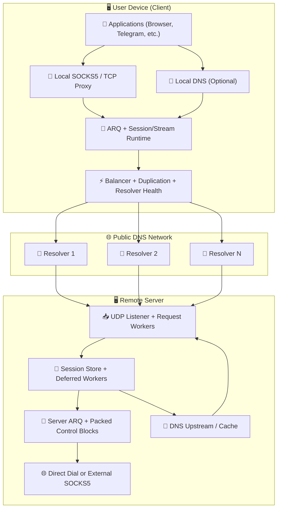
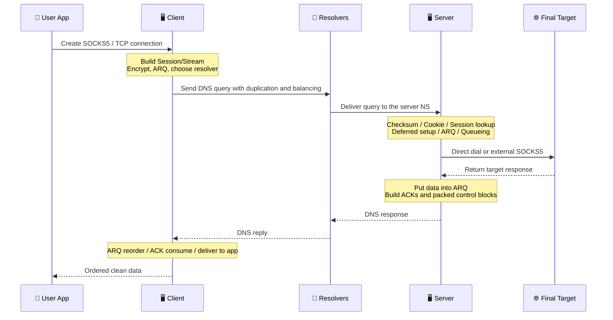

# MasterDnsVPN Project 🔐

## | [نسخه فارسی](https://github.com/masterking32/MasterDnsVPN/blob/main/README_FA.MD) | [English Version](https://github.com/masterking32/MasterDnsVPN/blob/main/README.MD) | [Русская  версия](https://github.com/masterking32/MasterDnsVPN/blob/main/README_RU.MD)  |

**MasterDnsVPN** - это научно-исследовательский проект, предназначенный для передачи TCP-трафика через DNS-запросы и ответы. В общем смысле он схож с проектами вроде DNSTT или SlipStream, однако использует принципиально иную архитектуру и подход к реализации.
Система спроектирована с учётом совместимости с различными типами DNS-резолверов и жёсткими сетевыми условиями, с целью обеспечить максимально возможную стабильность и доставку данных даже в неблагоприятных сценариях.

[](https://deepwiki.com/masterking32/MasterDnsVPN) [](https://oosmetrics.com/repo/masterking32/MasterDnsVPN)

<a href="https://trendshift.io/repositories/23688" target="_blank"></a>

### 📊 Сравнение MasterDnsVPN с аналогичными проектами

| Особенность | SlipStream | DNSTT | MasterDnsVPN |
| :--- | :--- | :--- | :--- |
| Тип протокола | Продвинутый DNS-туннель | Классический DNS-туннель | Продвинутый DNS-туннель / VPN |
| Транспортный протокол | QUIC | KCP + Noise | Кастомный протокол + ARQ |
| Накладные расходы заголовка | 🟠 ~24B | 🔴 ~59B | 🟢 ~5–7B<br>на ≈88% меньше DNSTT<br>на ≈71% меньше SlipStream |
| Тип шифрования | TLS 1.3 (внутри QUIC) | Noise (Curve25519) | AES / ChaCha20 / XOR (XOR легче, но менее безопасен) |
| Архитектура | Монолитная (QUIC обрабатывает всё) | Многоуровневая (KCP + SMUX + Noise) | 🟢 Лёгкая кастомная, оптимизированная под DNS |
| Скорость | 🟡 Высокая (до ~5 раз быстрее, чем DNSTT) | 🔴 Средняя | 🟢 Быстрее, чем другие<br>До ~9 раз быстрее, чем DNSTT<br>До ~3,6 раз быстрее, чем SlipStream |
| Устойчивость к потере пакетов | 🟡 Хорошая | 🟠 Средняя | 🟢 Очень высокая (Multipath + ARQ) |
| Поддержка нескольких резолверов | Да (multipath) | ❌ | Да — расширенный (несколько резолверов + дублирование) |
| Устойчивость к цензуре | Хорошая | Средняя | Очень высокая (основная цель проекта) |
| Сложность настройки | Средняя | Простая | Простая базовая, сложнее при тонкой настройке |
| Поддержка SOCKS5 | Да | Да | Оптимизировано для SOCKS5 / SOCKS4 с уменьшенными накладными расходами SOCKS |
| Поддержка Shadowsocks | ✅ | ❌ | Косвенно: режим TCP-передачи может поддерживать протоколы на основе TCP<br>, например Shadowsocks, VLESS/VMess и т. д. |
| Реальный multipath | Да (QUIC multipath) | ❌ | Да (мультирезолвер + дублирование) |
| Адаптивная маршрутизация | Ограниченная | ❌ | Расширенная (на основе задержки/потерь) |
| Цель проектирования | Высокая скорость и эффективность | Простота и стабильность | Работоспособность в самых сложных сетях — стабильность, скорость и эффективность |
| Язык реализации | Rust | Go | Go (основной), Python (legacy) |
| Встроенный балансировщик | 🔴 | ❌ | 🟢 (8 режимов) |
| Система дублирование пакетов | ❌ | ❌ | Да — увеличивает трафик для повышения надёжности (настраивается или может быть отключено) |
| Допуск MTU | Лучше чем DNSTT | - | Работает даже при очень маленьком значении MTU, т.к. накладные расходы протокола минимальны |
| Отказоустойчивость | ❌ | ❌ | ✅ |
| Скорость загрузки 10MB (Локально) | 🟡 0.978с | 🔴 2.492с | 🟢 0.270с |
| Скорость отправки 10MB (Локально) | 🟡 3.249с | 🔴 16.207с | 🟢 1.746s |
| Проверка состояния резолвера и авто-отключение | ❌ | ❌ | ✅ |
| Фоновая реактивация здоровых резолверов | ❌ | ❌ | ✅ |
| Локальный DNS на клиенте (для предотвращения перехвата DNS) | ❌ | ❌ | ✅ (с сильным/активным DNS кэшированием) |
| DNS через SOCKS5 | ❌ | ❌ | ✅ (с DNS кэшированием) |
| Тонкая настройка | 🟠 | 🟠 | 🟢 Большинство подсистем настраиваемы |
| Не требуется стороннее вспомогательное ПО | ❌ | ❌ | 🟢 Дополнительное программное обеспечение не требуется; при необходимости можно использовать совместно с SOCKS или такими инструментами, как Shadowsocks или OpenVPN
 |

---

### ❌ Отказ от ответственности / Disclaimer

MasterDnsVPN предоставляется исключительно в образовательных и исследовательских целях.

- **Предоставляется без гарантии:** Данное программное обеспечение предоставляется “КАК ЕСТЬ”, без каких-либо явных или подразумеваемых гарантий, включая гарантии товарной пригодности, пригодности для конкретной цели или отсутствия нарушений прав.
- **Ограничение ответственности:** Разработчики и участники проекта не несут ответственности за любые прямые, косвенные, случайные, последующие или иные убытки, возникающие в результате использования данного ПО или невозможности его использования.
- **Ответственность пользователя:** Использование данного проекта за пределами тестовых сред может привести к сбоям в работе сети или ее повреждению. Пользователь несет полную ответственность за все последствия установки, настройки и использования.
- **Соблюдение законодательства:** Использование данного проекта с целью обхода местного законодательства может повлечь за собой гражданско-правовые или уголовные последствия. Перед использованием ознакомьтесь с законодательством и нормативными актами вашей страны. Разработчики не несут ответственности за нарушение пользователями местного, национального или международного законодательства.
- **Условия лицензии:** Использование, копирование, распространение или модификация данного программного обеспечения регулируются условиями лицензии MIT, изложенными в файле [LICENSE](https://github.com/masterking32/MasterDnsVPN/blob/main/LICENSE) данного репозитория. Любое использование, не соответствующее этим условиям, запрещено.

---

## Канал новостей и поддержки 📢

Чтобы быть в курсе последних новостей, релизов и новостей о проектах, подпишитесь на наш канал в Telegram: [Telegram Channel](https://t.me/masterdnsvpn)

---

### Если вам понравился этот проект, пожалуйста, поддержите его, поставив звездочку на GitHub (⭐). Это поможет проекту привлечь внимание.

---

### Добровольная финансовая поддержка 💸

- TON:

`masterking32.ton`

- EVM-совместимые сети (ETH и совместимые цепочки):

`0x517f07305D6ED781A089322B6cD93d1461bF8652`

- TRC20 (TRON):

`TLApdY8APWkFHHoxebxGY8JhMeChiETqFH`

Мы ценим каждый вклад и каждый отзыв. Ваша поддержка напрямую способствует дальнейшему развитию и совершенствованию проекта..

---

## Основные характеристики и преимущества ✨

Краткий обзор основных возможностей MasterDnsVPN:

- **Устойчивость к цензуре и работоспособность в сложных сетях:** 🛡️ Разработан для работы в сетях с фильтрацией, при нестабильном соединении и в условиях жестких ограничений по размеру MTU.
- **Оптимизированный кастомный протокол:** 🔄 Использует кастомный протокол с механизмом повторной передачи данных, что позволяет сократить накладные расходы и увеличить полезный объем данных DNS.
- **Multipath и дублирование пакетов:** 📡 Трафик передается по нескольким маршрутам, а также поддерживается выборочное дублирование для повышения вероятности доставки в нестабильных сетях.
- **Умный выбор резолверов и проверка их работоспособности:** ⚡ Выбор резолверов на основе их качества и работоспособности, а также автоматическое управление проблемными резолверами.
- **Определение и синхронизация MTU:** 🧰 Определяет фактический размер MTU рабочих маршрутов и синхронизирует их с ним, чтобы уменьшить фрагментацию и повысить стабильность.
- **Поддержка и оптимизация SOCKS5 / SOCKS4:** 🧦 Оптимизирована работа с локальным прокси для популярных приложений.
- **Объединение блоков управления и снижение нагрузки на каналы управления:** 📦 Объединяет пакеты подтверждения (ACK) и управляющий трафик для уменьшения количества управляющих сообщений.
- **Опциональное сжатие и упаковка запросов:** 🗜️ Уменьшает количество запросов и повышает эффективность при использовании малых значений MTU.
- **Гибкое шифрование:** 🔐 Поддерживает несколько методов шифрования для обеспечения оптимального соотношения скорости и безопасности.
- **Опциональный клиентский DNS и кэширование:** 📛 Позволяет предоставлять доступ к локальному DNS-сервису, сокращать задержки и ограничивать возможности перехвата.
- **Масштабируемое управление ресурсами:** ⚙️ Может работать на небольших серверах или быть настроено для более высоких нагрузок.

Этот список представляет собой лишь общее краткое изложение. В соответствующих разделах ниже каждая область описана более подробно.

---

## 🌐 Проверенный в бою во время полного отключения интернета

MasterDnsVPN — это не просто теоретический проект. Он прошел испытание в реальных условиях и доказал свою эффективность в ситуациях, когда глобальный интернет полностью отключен.

Недавно, во время 88-дневного отключения интернета в Иране, власти не просто заблокировали VPN или отфильтровали сайты — они полностью отключили международную пропускную способность. Поскольку 99% связи с внешним миром было физически отключено, пользователи оказались запертыми в закрытой локальной сети. 

Стандартные инструменты обхода блокировок бесполезны, когда нет международного интернета, к которому можно подключиться. Однако во время этого масштабного отключения MasterDnsVPN выделился как один из немногих спасательных кругов, которые действительно позволили пользователям оставаться на связи с глобальной сетью.

**Как он выжил при полном отключении?**
Вместо того чтобы действовать как стандартный VPN, MasterDnsVPN использует интеллектуальные технологии DNS-туннелирования, чтобы пробиться сквозь блокировку:
* **Несколько резолверов:** он направляет трафик через различные DNS-резолверы, гарантируя, что соединение никогда не будет зависеть от одного, легко блокируемого пути.
* **Шифрование и разбиение данных:** он шифрует ваши данные и разбивает их на крошечные, разбросанные фрагменты.
* **Маскировка под легитимный трафик:** он упаковывает эти фрагменты данных в стандартные, совершенно обычные DNS-запросы. 
* **Обход локальных ограничений:** поскольку трафик выглядит точно так же, как обычные повседневные DNS-запросы, брандмауэры пропускают его. Данные преобразуются и попадают во внешний мир — даже если сеть заставляет вас использовать собственные ограниченные локальные серверы преобразования, контролируемые государством.

Именно эта комбинация позволила MasterDnsVPN поддерживать стабильное соединение, когда доступ к внешнему миру был полностью заблокирован.

---

# Установка и запуск 🧑‍💻

## Раздел 1: 🖥️ Настройка сервера

### Раздел 1.1: 🌐 Настройка и подготовка домена (Требования)

Чтобы принимать DNS-запросы непосредственно на вашем сервере, необходимо делегировать ему субдомен. Проще говоря, создайте две записи: одну `A` запись, указывающую на IP-адрес вашего сервера, и одну запись `NS`, делегирующую субдомен туннеля этой `A` записи.

#### Шаг 1.1.1: 🅰️ Создание A записи (Server Address)

- **Тип:** `A`
- **Имя:** короткое имя, например `ns`
- **Значение:** IPv4-адрес вашего сервера

> Пример: `ns.example.com -> 1.2.3.4`

> Примечание Cloudflare: если для домена используется Cloudflare, откройте страницу `DNS` и нажмите на значок облака рядом с `A` записью, чтобы он стал серым (`Только DNS`). Прокси должен быть отключён.

#### Шаг 1.1.2: 🏷️ Создание NS записи (Delegate the Subdomain)

- **Тип:** `NS`
- **Имя:** субдомен туннеля, например `v`
- **Значение / Цель:** `ns.example.com`

> Пример: `v.example.com -> ns.example.com`

> Примечание Cloudflare: добавьте запись `NS` в обычном порядке. Cloudflare не проксирует записи NS, но убедитесь, что для записи A `ns` уже установлен параметр `Только DNS`.

#### Шаг 1.1.3: 💡 Краткая информация о MTU

Более короткие доменные имена оставляют больше места для фактических данных в каждом DNS-запросе. Для повышения пропускной способности используйте короткие имена. Если вы используете Cloudflare, все равно сохраняйте соответствующие записи в режиме `Только DNS`.

---

### Раздел 1.2: 🐧 Быстрая установка на Linux

#### шаг 1.2.1: Автоматическая установка (Script)

Если вы хотите развернуть сервер MasterDnsVPN на Linux, проще всего воспользоваться скриптом автоматической установки. Выполните на Linux сервере следующую команду:

```bash
bash <(curl -Ls https://raw.githubusercontent.com/masterking32/MasterDnsVPN/main/server_linux_install.sh)
```

Скрипт автоматически выполняет установку и настройку. По завершении сервер запускается, а **ключ шифрования** отображается в терминале и записывается в файл `encrypt_key.txt`, расположенный рядом с исполняемым файлом. Храните этот ключ в надежном месте.

#### Шаг 1.2.2: Важные замечания после установки

- В процессе установки вам будет предложено указать домен. Это должен быть тот же делегированный субдомен, который вы настроили в `NS` записи, например `v.example.com`.
- После создания DNS-записей дождитесь их распространения (propagation). Это может занять от нескольких минут до нескольких часов, а в отдельных случаях — до 48 часов, в зависимости от значения TTL и используемого DNS-провайдера.
- Для проверки настройки DNS можно использовать утилиты `dig` или `nslookup`, например: `dig v.example.com NS` или `nslookup -type=ns v.example.com`. Для прямого запроса к новому DNS-серверу: `dig @ns.example.com v.example.com A`.
- Если на сервере включен брандмауэр, разрешите UDP-порт 53. Пример для `ufw`:

```bash
sudo ufw allow 53/udp
sudo ufw reload
```

Для `firewalld`:

```bash
sudo firewall-cmd --add-port=53/udp --permanent
sudo firewall-cmd --reload
```

- Если порт `53` уже занят другой службой, например `systemd-resolved`, обратитесь к разделу по устранению неполадок “Устранение проблемы с занятым портом 53”.
- Ключ шифрования (`encrypt_key.txt`) отображается после установки. Скопируйте его и храните в надежном месте, так как он необходим клиенту для подключения.

---

## Раздел 2: 🚀 Установка и запуск (Client and Server)

Вы можете установить и запустить этот проект двумя способами:

1. Использовать готовые бинарные файлы (рекомендуется для большинства пользователей)
2. Запустить напрямую из исходного кода с помощью **Go** (рекомендуется для разработчиков)

---

### Раздел 2.1: Использование готовых сборок (✅ Recommended)

Для удобства, в разделе релизов размещены готовые бинарные файлы клиента и сервера. Загрузите архив, соответствующий вашей операционной системе, и распакуйте его.

> 💡 **Примечание:** Архивы содержат исполняемый файл и примеры конфигурационных файлов.

#### Ссылки для скачивания клиентов 📥

| Операционная система | Архитектура | Совместимость | Загрузка |
| :--- | :--- | :--- | :--- |
| Windows 🪟 | `AMD64` (64-bit) | Windows 10 and 11 | [Download Windows Client ⬇️](https://github.com/masterking32/MasterDnsVPN/releases/latest/download/MasterDnsVPN_Client_Windows_AMD64.zip) |
| Windows 🪟 | `x86` (32-bit) | Older 32-bit Windows systems | [Download Windows x86 Client ⬇️](https://github.com/masterking32/MasterDnsVPN/releases/latest/download/MasterDnsVPN_Client_Windows_X86.zip) |
| Windows 🪟 | `ARM64` | Windows on ARM devices | [Download Windows ARM64 Client ⬇️](https://github.com/masterking32/MasterDnsVPN/releases/latest/download/MasterDnsVPN_Client_Windows_ARM64.zip) |
| macOS 🍎 | `ARM64` | Apple Silicon Macs (M1 / M2 / M3) | [Download macOS Client ⬇️](https://github.com/masterking32/MasterDnsVPN/releases/latest/download/MasterDnsVPN_Client_MacOS_ARM64.zip) |
| macOS 🍎 | `AMD64` | Intel Macs | [Download macOS Intel Client ⬇️](https://github.com/masterking32/MasterDnsVPN/releases/latest/download/MasterDnsVPN_Client_MacOS_AMD64.zip) |
| Linux 🐧 | `AMD64` (64-bit) | Modern distributions (Ubuntu 22.04+, Debian 12+) | [Download Linux Client ⬇️](https://github.com/masterking32/MasterDnsVPN/releases/latest/download/MasterDnsVPN_Client_Linux_AMD64.zip) |
| Linux 🐧 | `x86` (32-bit) | Older 32-bit Linux systems | [Download Linux x86 Client ⬇️](https://github.com/masterking32/MasterDnsVPN/releases/latest/download/MasterDnsVPN_Client_Linux_X86.zip) |
| Linux (Legacy) 🐧 | `AMD64` (64-bit) | Older distributions (Ubuntu 20.04, Debian 11) | [Download Linux Legacy Client ⬇️](https://github.com/masterking32/MasterDnsVPN/releases/latest/download/MasterDnsVPN_Client_Linux-Legacy_AMD64.zip) |
| Linux (Legacy) 🐧 | `ARM64` | Older ARM64 Linux systems that need broader compatibility | [Download Linux Legacy ARM64 Client ⬇️](https://github.com/masterking32/MasterDnsVPN/releases/latest/download/MasterDnsVPN_Client_Linux-Legacy_ARM64.zip) |
| Linux (ARM) 🐧 | `ARM64` | ARM servers, Raspberry Pi, and similar boards | [Download Linux ARM Client ⬇️](https://github.com/masterking32/MasterDnsVPN/releases/latest/download/MasterDnsVPN_Client_Linux_ARM64.zip) |
| Linux (ARM) 🐧 | `ARMv7` | 32-bit ARM boards and older embedded Linux devices | [Download Linux ARMv7 Client ⬇️](https://github.com/masterking32/MasterDnsVPN/releases/latest/download/MasterDnsVPN_Client_Linux_ARMV7.zip) |
| Linux (ARM) 🐧 | `ARMv6` | Older ARM boards and lightweight Linux devices | [Download Linux ARMv6 Client ⬇️](https://github.com/masterking32/MasterDnsVPN/releases/latest/download/MasterDnsVPN_Client_Linux_ARMV6.zip) |
| Linux (ARM) 🐧 | `ARMv5` | Very old ARM devices and embedded Linux systems | [Download Linux ARMv5 Client ⬇️](https://github.com/masterking32/MasterDnsVPN/releases/latest/download/MasterDnsVPN_Client_Linux_ARMV5.zip) |
| Linux 🐧 | `RISCV64` | RISC-V Linux boards and servers | [Download Linux RISCV64 Client ⬇️](https://github.com/masterking32/MasterDnsVPN/releases/latest/download/MasterDnsVPN_Client_Linux_RISCV64.zip) |
| Linux (MIPS) 🐧 | `MIPS` | Big-endian MIPS Linux and router platforms | [Download Linux MIPS Client ⬇️](https://github.com/masterking32/MasterDnsVPN/releases/latest/download/MasterDnsVPN_Client_Linux_MIPS.zip) |
| Linux (MIPS) 🐧 | `MIPSLE` | Little-endian MIPS Linux and router platforms | [Download Linux MIPSLE Client ⬇️](https://github.com/masterking32/MasterDnsVPN/releases/latest/download/MasterDnsVPN_Client_Linux_MIPSLE.zip) |
| Linux (MIPS) 🐧 | `MIPS64` | 64-bit big-endian MIPS Linux systems | [Download Linux MIPS64 Client ⬇️](https://github.com/masterking32/MasterDnsVPN/releases/latest/download/MasterDnsVPN_Client_Linux_MIPS64.zip) |
| Linux (MIPS) 🐧 | `MIPS64LE` | 64-bit little-endian MIPS Linux systems | [Download Linux MIPS64LE Client ⬇️](https://github.com/masterking32/MasterDnsVPN/releases/latest/download/MasterDnsVPN_Client_Linux_MIPS64LE.zip) |
| Termux / Android 📱 | `ARM64` | Modern Android phones running Termux | [Download Termux ARM64 Client ⬇️](https://github.com/masterking32/MasterDnsVPN/releases/latest/download/MasterDnsVPN_Client_Termux_ARM64.zip) |
| Termux / Android 📱 | `ARMv7` | Older Android phones running 32-bit Termux environments | [Download Termux ARMv7 Client ⬇️](https://github.com/masterking32/MasterDnsVPN/releases/latest/download/MasterDnsVPN_Client_Termux_ARMV7.zip) |

#### Ссылки для скачивания серверов 📤

*(Используйте это, если не хотите использовать скрипт автоматический установки для Linux.)*

| Операционная система | Архитектура | Совместимость | Загрузка |
| :--- | :--- | :--- | :--- |
| Windows 🪟 | `AMD64` (64-bit) | Windows Server, Windows 10 and 11 | [Download Windows Server ⬇️](https://github.com/masterking32/MasterDnsVPN/releases/latest/download/MasterDnsVPN_Server_Windows_AMD64.zip) |
| Windows 🪟 | `x86` (32-bit) | Older 32-bit Windows systems | [Download Windows x86 Server ⬇️](https://github.com/masterking32/MasterDnsVPN/releases/latest/download/MasterDnsVPN_Server_Windows_X86.zip) |
| Windows 🪟 | `ARM64` | Windows on ARM devices | [Download Windows ARM64 Server ⬇️](https://github.com/masterking32/MasterDnsVPN/releases/latest/download/MasterDnsVPN_Server_Windows_ARM64.zip) |
| Linux 🐧 | `AMD64` (64-bit) | Ubuntu 22.04+, Debian 12+ servers | [Download Linux Server ⬇️](https://github.com/masterking32/MasterDnsVPN/releases/latest/download/MasterDnsVPN_Server_Linux_AMD64.zip) |
| Linux 🐧 | `x86` (32-bit) | Older 32-bit Linux systems | [Download Linux x86 Server ⬇️](https://github.com/masterking32/MasterDnsVPN/releases/latest/download/MasterDnsVPN_Server_Linux_X86.zip) |
| Linux (Legacy) 🐧 | `AMD64` (64-bit) | Older servers (Ubuntu 20.04, Debian 11) | [Download Linux Legacy Server ⬇️](https://github.com/masterking32/MasterDnsVPN/releases/latest/download/MasterDnsVPN_Server_Linux-Legacy_AMD64.zip) |
| Linux (Legacy) 🐧 | `ARM64` | Older ARM64 Linux systems that need broader compatibility | [Download Linux Legacy ARM64 Server ⬇️](https://github.com/masterking32/MasterDnsVPN/releases/latest/download/MasterDnsVPN_Server_Linux-Legacy_ARM64.zip) |
| Linux (ARM) 🐧 | `ARM64` | ARM servers | [Download Linux ARM Server ⬇️](https://github.com/masterking32/MasterDnsVPN/releases/latest/download/MasterDnsVPN_Server_Linux_ARM64.zip) |
| Linux (ARM) 🐧 | `ARMv7` | 32-bit ARM servers and embedded Linux devices | [Download Linux ARMv7 Server ⬇️](https://github.com/masterking32/MasterDnsVPN/releases/latest/download/MasterDnsVPN_Server_Linux_ARMV7.zip) |
| Linux (ARM) 🐧 | `ARMv6` | Older ARM boards and lightweight Linux devices | [Download Linux ARMv6 Server ⬇️](https://github.com/masterking32/MasterDnsVPN/releases/latest/download/MasterDnsVPN_Server_Linux_ARMV6.zip) |
| Linux (ARM) 🐧 | `ARMv5` | Very old ARM devices and embedded Linux systems | [Download Linux ARMv5 Server ⬇️](https://github.com/masterking32/MasterDnsVPN/releases/latest/download/MasterDnsVPN_Server_Linux_ARMV5.zip) |
| Linux 🐧 | `RISCV64` | RISC-V Linux boards and servers | [Download Linux RISCV64 Server ⬇️](https://github.com/masterking32/MasterDnsVPN/releases/latest/download/MasterDnsVPN_Server_Linux_RISCV64.zip) |
| Linux (MIPS) 🐧 | `MIPS` | Big-endian MIPS Linux and router platforms | [Download Linux MIPS Server ⬇️](https://github.com/masterking32/MasterDnsVPN/releases/latest/download/MasterDnsVPN_Server_Linux_MIPS.zip) |
| Linux (MIPS) 🐧 | `MIPSLE` | Little-endian MIPS Linux and router platforms | [Download Linux MIPSLE Server ⬇️](https://github.com/masterking32/MasterDnsVPN/releases/latest/download/MasterDnsVPN_Server_Linux_MIPSLE.zip) |
| Linux (MIPS) 🐧 | `MIPS64` | 64-bit big-endian MIPS Linux systems | [Download Linux MIPS64 Server ⬇️](https://github.com/masterking32/MasterDnsVPN/releases/latest/download/MasterDnsVPN_Server_Linux_MIPS64.zip) |
| Linux (MIPS) 🐧 | `MIPS64LE` | 64-bit little-endian MIPS Linux systems | [Download Linux MIPS64LE Server ⬇️](https://github.com/masterking32/MasterDnsVPN/releases/latest/download/MasterDnsVPN_Server_Linux_MIPS64LE.zip) |
| macOS 🍎 | `ARM64` | Apple Silicon Macs | [Download macOS Server ⬇️](https://github.com/masterking32/MasterDnsVPN/releases/latest/download/MasterDnsVPN_Server_MacOS_ARM64.zip) |
| macOS 🍎 | `AMD64` | Intel Macs | [Download macOS Intel Server ⬇️](https://github.com/masterking32/MasterDnsVPN/releases/latest/download/MasterDnsVPN_Server_MacOS_AMD64.zip) |
| Termux / Android 📱 | `ARM64` | Modern Android / Termux environments | [Download Termux ARM64 Server ⬇️](https://github.com/masterking32/MasterDnsVPN/releases/latest/download/MasterDnsVPN_Server_Termux_ARM64.zip) |
| Termux / Android 📱 | `ARMv7` | Older Android / 32-bit Termux environments | [Download Termux ARMv7 Server ⬇️](https://github.com/masterking32/MasterDnsVPN/releases/latest/download/MasterDnsVPN_Server_Termux_ARMV7.zip) |

---

### Раздел 2.2: 📦 MasterDnsVPN Docker Image

---

#### Раздел 2.2.1: ⚠️ Обзор

Этот Docker образ запускает сервер MasterDnsVPN в контейнерной среде и поддерживает сборки для нескольких архитектур.

Он автоматически:

* Загружает конфигурацию по умолчанию, если собственная отсутствует
* Добавляет ваш домен при первом запуске
* Сохраняет постоянные данные в каталоге `/data`

---

#### Раздел 2.2.2: 🖥 Поддерживаемые архитектуры

* linux/amd64
* linux/arm/v5
* linux/arm/v7
* linux/arm64/v8
* linux/mips64le

---

#### Раздел 2.2.3: 🚀 Быстрый старт

Запуск через docker run:

```bash
docker run -d \
  --name masterdnsvpn \
  --restart unless-stopped \
  -e DOMAIN=v.example.com \
  -v $(pwd)/data:/data \
  -p 53:53/tcp \
  -p 53:53/udp \
  ghcr.io/masterking32/masterdnsvpn:latest
```

---

#### Раздел 2.2.4: 🧪 Пример запуска через docker-compose

```yaml
services:
  masterdnsvpn:
    image: ghcr.io/masterking32/masterdnsvpn:latest
    restart: unless-stopped
    environment:
      - DOMAIN=v.example.com
    volumes:
      - ./data:/data
    ports:
      - "53:53/tcp"
      - "53:53/udp"
```

---

#### Раздел 2.2.5: ⚙️ Необходимые переменные среды

| Переменная | Описание                             |
| -------- | --------------------------------------- |
| DOMAIN   | Ваш DNS домен (требуется при первом запуске) |

> ⚠️ Если при первом запуске переменная `DOMAIN` не указана, контейнер будет остановлен с ошибкой.

---

#### Раздел 2.2.6: 📁 Постоянные данные

Хранятся в `/data`:

* `server_config.toml`
* `encrypt_key.txt`

Вы можете смонтировать его в качестве тома (volume):

```bash
-v ./data:/data
```

---

#### Раздел 2.2.7: 🔧 Использование MikroTik / RouterOS

Для контейнеров MikroTik:

* Используйте последнюю версию MikroTik RouterOS v7
* Настройте NAT-перенаправление на порт UDP/TCP 53 в ваш контейнер
* Полная инструкция по настройке контейнера MikroTik: https://help.mikrotik.com/docs/spaces/ROS/pages/84901929/Container

Пример:

```bash
/container mounts
add dst=/data list=MasterDnsVPN src=/containers/mounts/MasterDnsVPN

/container envs
add key=DOMAIN list=MasterDnsVPN value=v.example.com

/container add check-certificate=no dns=1.1.1.1 envlists=MasterDnsVPN hostname=MasterDnsVPN interface=MasterDnsVPN layer-dir="" mountlists=MasterDnsVPN name=MasterDnsVPN remote-image=ghcr.io/masterking32/masterdnsvpn:latest root-dir=/containers/data/MasterDnsVPN start-on-boot=yes
```

---

#### Раздел 2.2.8: 📌 Замечания

* Обязателен порт DNS `53` (UDP/TCP)
* НЕ запускайте другой DNS-сервис на том же хосте
* Предназначен для использования в производственной среде, но при этом остается компактным
* Не требует модификации systemd или хоста

---

### Раздел 2.3: 🪟 Подготовка и запуск клиента на Windows

- После загрузки пакета для Windows распакуйте его.
- Откройте файл `client_config.toml` в текстовом редакторе, например в Блокноте.
- Замените значения по умолчанию на свой реальный домен, ключ шифрования и список резолверов.
- Запустите исполняемый файл клиента.
- Настройте браузер или приложение на использование локального SOCKS5-прокси по адресу `127.0.0.1:18000`, если вы не изменили настройки по умолчанию.

---

### Раздел 2.3: 🐧 Подготовка и запуск Linux / macOS

После загрузки пакета для Linux:

```bash
sudo apt update
sudo apt install unzip nano
```

Распакуйте архив:

```bash
unzip MasterDnsVPN_Client_Linux_AMD64.zip
ls
```

При необходимости предоставьте права на выполнение:

```bash
chmod +x MasterDnsVPN_Client_Linux_AMD64
chmod +x MasterDnsVPN_Server_Linux_AMD64
```

Отредактируйте файлы конфигурации:

```bash
nano client_config.toml
nano server_config.toml
```

Запуск:

```bash
./MasterDnsVPN_Client_Linux_AMD64
./MasterDnsVPN_Server_Linux_AMD64
```

---

### Раздел 2.4: 🧑‍💻 Сборка и запуск из исходного кода (Go)

> ⚠️ Этот раздел предназначен для разработчиков или пользователей, которые хотят запустить текущий исходный код Go напрямую.

#### Требования

- Go `1.24` или новее

#### Сборка из исходного кода

```bash
git clone https://github.com/masterking32/MasterDnsVPN.git
cd MasterDnsVPN

go build -o masterdnsvpn-client ./cmd/client
go build -o masterdnsvpn-server ./cmd/server
```

На Windows:

```powershell
git clone https://github.com/masterking32/MasterDnsVPN.git
cd MasterDnsVPN

go build -o masterdnsvpn-client.exe .\cmd\client
go build -o masterdnsvpn-server.exe .\cmd\server
```

#### Создание конфигурационных файлов

На Linux и macOS:

```bash
cp client_config.toml.simple client_config.toml
cp server_config.toml.simple server_config.toml
cp client_resolvers.simple client_resolvers.txt
```

На Windows:

```powershell
Copy-Item client_config.toml.simple client_config.toml
Copy-Item server_config.toml.simple server_config.toml
Copy-Item client_resolvers.simple client_resolvers.txt
```

#### Запуск сервера и клиента

```bash
./masterdnsvpn-server -config server_config.toml
./masterdnsvpn-client -config client_config.toml
```

На Windows:

```powershell
.\masterdnsvpn-server.exe -config server_config.toml
.\masterdnsvpn-client.exe -config client_config.toml
```

#### Параметры запуска

Оба исполняемых файла поддерживают эти аргументы:

| Параметр | Описание |
| :--- | :--- |
| `-config` | Пуль к файлу конфигурации |
| `-log` | Опциональный путь для лог файлов |
| `-version` | Вывод версии |

Пример:

```bash
./masterdnsvpn-server -config server_config.toml -log server.log
./masterdnsvpn-client -config client_config.toml -log client.log
```

---

# Раздел 3: Конфигурационные файлы и структура 🛠️

## Раздел 3.1: Важные файлы проекта 📂

| Файл | Назначение |
| :--- | :--- |
| `client_config.toml` | Основная конфигурация клиента |
| `server_config.toml` | Основная конфигурация сервера |
| `client_resolvers.txt` | Список резолверов |
| `encrypt_key.txt` | Ключ шифрования на стороне сервера |
| `client_config.toml.simple` | Полный пример конфигурации клиента для текущей версии Go |
| `server_config.toml.simple` | Полный пример конфигурации сервера для текущей версии Go |

Допустимые форматы в `client_resolvers.txt`:

- `IP`
- `IP:PORT`
- `CIDR`
- `CIDR:PORT`

Пример:

```text
8.8.8.8
1.1.1.1:53
9.9.9.0/24
208.67.222.0/24:5353
```

---

## Раздел 3.2: Быстрый чек-лист клиента 🚀

На клиенте должны присутствовать следующие обязательные параметры::

1. **`ENCRYPTION_KEY`** должен совпадать с содержимым файла `encrypt_key.txt` на сервере
2. **`DOMAINS`** должен соответствовать домену сервера
3. **`client_resolvers.txt`** должен содержать рабочие DNS-резолверы
4. Для обычного использования оставьте **`PROTOCOL_TYPE = "SOCKS5"`**

---

## Раздел 3.3: Быстрый чек-лист сервера ⚙️

На сервере критически важны следующие настройки:

1. Установите **`DOMAIN`** в значение вашего делегированного туннельного домена
2. **`DATA_ENCRYPTION_METHOD`** должен совпадать с клиентской конфигурацией
3. **`ENCRYPTION_KEY_FILE`** задаёт путь к файлу ключа на сервере
4. Для прямых исходящих подключений оставьте **`USE_EXTERNAL_SOCKS5 = false`**
5. Если требуется цепочка через внешний SOCKS5-прокси, установите `USE_EXTERNAL_SOCKS5 = true` и заполните `FORWARD_IP` / `FORWARD_PORT`


---

## Раздел 3.4: 📘 Переменные конфигурации клиента (`client_config.toml`)

### 3.4.1) 🧭 Идентификация и безопасность туннеля

| Параметр | Пример значения | Значения | Полное описание |
| :--- | :--- | :--- | :--- |
| `PROTOCOL_TYPE` | `"SOCKS5"` | `"SOCKS5"` или `"TCP"` | Выбирает режим локальной службы, предоставляемый клиентом.<br>`SOCKS5` — это режим по умолчанию, рекомендуемый для обычного использования.<br>`TCP` удобен в тех случаях, когда требуется перенаправлять трафик на один фиксированный удаленный адрес, а не предоставлять приложениям SOCKS-прокси. |
| `DOMAINS` | `["v.example.com"]` | Непустой список строк | Это туннельные домены, используемые для формирования DNS-запросов.<br>Каждый домен в списке должен относиться к тому же туннелю, который настроен на сервере.<br>Если список задан неверно, клиент может формировать корректные DNS-запросы, которые сервер будет просто игнорировать. |
| `DATA_ENCRYPTION_METHOD` | `1` | `0..5` | Должен совпадать с сервером.<br>0=None (без шифрования), 1=XOR, 2=ChaCha20, 3=AES-128-GCM, 4=AES-192-GCM, 5=AES-256-GCM.<br>XOR лёгкий, но менее надёжный. Режимы AEAD (ChaCha20, AES) обеспечивают более высокую безопасность, но имеют больше накладных расходов. |
| `ENCRYPTION_KEY` | `""` | Строка | Секретный ключ, используемый клиентом.<br>Он должен точно совпадать с ключом шифрования на стороне сервера.<br>Если ключ указан неверно, пакеты могут быть интерпретированы как мусорные данные, и туннель не будет работать. |

### 3.4.2) 🧦 Локальный прокси

| Параметр | Пример значения | Значения | Полное описание |
| :--- | :--- | :--- | :--- |
| `LISTEN_IP` | `"127.0.0.1"` | Строка с IPv4 |
Адрес, на котором клиент принимает подключения от локальных пользователей прокси.<br>Используйте `127.0.0.1` для обычного локального использования.<br>Если на системе некоторые приложения предпочитают IPv6 localhost, вариант `localhost` может быть более подходящим для локального доступа.<br>Используйте `0.0.0.0` только в случае, если требуется открыть прокси для сети и понятны связанные риски безопасности. |
| `LISTEN_PORT` | `18000` | `0..65535` | Порт для локального прокси-сервера.<br>Ваши приложения должны использовать этот порт для отправки трафика через туннель. |
| `SOCKS5_AUTH` | `false` | `true/false` | Включает аутентификацию по имени пользователя и паролю на локальном SOCKS5-прокси.<br>Если вы используете привязку к `0.0.0.0`, настоятельно рекомендуется включить эту опцию. |
| `SOCKS5_USER` | `"master_dns_vpn"` | До 255 байт | Имя пользователя для локального SOCKS5-прокси. <br>Используется только при значении `SOCKS5_AUTH=true`. |
| `SOCKS5_PASS` | `"master_dns_vpn"` | До 255 байт | Пароль для локального SOCKS5-прокси. <br>Используется только при значении `SOCKS5_AUTH=true`. |

### 3.4.3) 📛 Локальный DNS

| Параметр | Пример значения | Значения | Полное описание |
| :--- | :--- | :--- | :--- |
| `LOCAL_DNS_ENABLED` | `false` | `true/false` | Если эта опция включена, клиент предоставляет доступ к локальной службе DNS и может выполнять разрешение DNS-имен через туннель.<br>Это полезно для предотвращения перехвата DNS-запросов или в тех случаях, когда необходимо, чтобы приложения также использовали туннель для работы с DNS. |
| `LOCAL_DNS_IP` | `"127.0.0.1"` | Строка с IPv4 | Адрес для локального прослушивателя DNS. |
| `LOCAL_DNS_PORT` | `53` | `0..65535` | Порт локальной службы DNS.<br>Стандартный порт — `53`, но в некоторых системах он может быть уже занят другой службой. |
| `LOCAL_DNS_CACHE_MAX_RECORDS` | `5000` | Если `<1`, применяется значение по умолчанию | Максимальное количество записей в локальном кэше DNS. <br>Более высокое значение сокращает количество повторных запросов к DNS, но требует большего объема памяти. |
| `LOCAL_DNS_CACHE_TTL_SECONDS` | `28800.0` | Если `<=0`, применяется значение по умолчанию | Срок хранения успешных записей DNS в локальном кэше. |
| `LOCAL_DNS_PENDING_TIMEOUT_SECONDS` | `300.0` | Если `<=0`, применяется значение по умолчанию | Если в данный момент выполняется локальный DNS-запрос, последующие запросы могут дождаться его завершения вместо отправки нового запроса на сервер. <br>Это значение определяет, как долго они могут ждать. |
| `LOCAL_DNS_CACHE_PERSIST_TO_FILE` | `true` | `true/false` | Если эта опция включена, содержимое локального кэша DNS может быть сохранено на диск для повторного использования между запусками. |
| `LOCAL_DNS_CACHE_FLUSH_INTERVAL_SECONDS` | `60.0` | Если `<=0`, применяется значение по умолчанию | Периодичность записи сохраненного локального кэша DNS на диск. |
| `DNS_RESPONSE_FRAGMENT_TIMEOUT_SECONDS` | `10.0` | Если `<=0`, применяется значение по умолчанию | Сколько времени клиент будет ждать отсутствующие фрагменты ответа DNS-туннеля, прежде чем прекратить попытку. |

### 3.4.4) ⚡ Выбор резолверов, дублирование, проверка состояния и отказоустойчивость

| Параметр | Пример значения | Значения | Полное описание |
| :--- | :--- | :--- | :--- |
| `RESOLVER_BALANCING_STRATEGY` | `2` | `0..8` | Определяет способ выбора резолверов.<br>`0/2` = Round Robin (по кругу), `1` = случайный выбор, `3` = минимальные потери, `4` = наименьшая задержка, `5` = гибридная оценка, `6` = сначала потери, затем задержка, `7` = случайный выбор среди лучших по потерям, `8` = циклический выбор среди лучших по потерям.<br>Гибридный режим использует взвешенную комбинированную оценку. Режим "сначала потери, затем задержка" сначала отбирает по уровню потерь, затем предпочитает меньшую задержку внутри этой группы и распределяет нагрузку между близкими по характеристикам кандидатами. Режим «top-random» выбирает случайно из лучшей группы по потерям, чтобы нагрузка не концентрировалась на одном резолвере. Режим "top-round-robin" последовательно перебирает ту же лучшую группу по потерям с детерминированной ротацией. |
| `PACKET_DUPLICATION_COUNT` | `2` | Допустимое значение ограничего в коде | Количество дублирования исходящих пакетов в обычном режиме.<br>Более высокие значения увеличивают сетевые накладные расходы, но повышают устойчивость на нестабильных каналах.
| `SETUP_PACKET_DUPLICATION_COUNT` | `2` | Допустимое значение ограничего в коде | Аналогично `PACKET_DUPLICATION_COUNT`, но используется для пакетов, чувствительных к настройкам, таких как создание потока и другие критические управляющие события. |
| `STREAM_RESOLVER_FAILOVER_RESEND_THRESHOLD` | `2` | Если `<1`, применяется значение по умолчанию | Если поток накапливает повторные запросы на повторную отправку через один и тот же предпочитаемый резолвер, клиент может переключить этот поток на другой резолвер.<br>Этот порог определяет, как быстро происходит такое переключение.

| `STREAM_RESOLVER_FAILOVER_COOLDOWN` | `2.5` | Если `<=0`, применяется значение по умолчанию | Минимальная задержка между двумя переключениями резолвера для одного и того же потока.<br>Предотвращает нестабильные "качели" (oscillation) между резолверами.
| `RECHECK_INACTIVE_SERVERS_ENABLED` | `true` | `true/false` | Включает фоновую повторную проверку резолверов, которые отключены или считаются неработоспособными.<br>Если отключено, резолвер, ставший недоступным, останется отключённым до перезапуска или ручного восстановления. |
| `AUTO_DISABLE_TIMEOUT_SERVERS` | `true` | `true/false` | Включает автоматическое отключение резолверов, которые постоянно не отвечают и не показывают успешной активности. |
| `AUTO_DISABLE_TIMEOUT_WINDOW_SECONDS` | `30.0` | Если `<=0`, применяется значение по умолчанию | Время для определения того, отвечает ли резолвер.<br>Если все наблюдения в пределах этого интервала — таймауты, резолвер может быть отключён. |
| `BASE_ENCODE_DATA` | `false` | `true/false` | Если включено, полезная нагрузка кодируется в безопасный для передачи формат (base-safe) перед туннелированием.<br>Обычно это снижает эффективность передачи, но может помочь в условиях строгих резолверов. |

### 3.4.5) 🗜️ Сжатие

| Параметр | Пример значения | Значения | Полное описание |
| :--- | :--- | :--- | :--- |
| `UPLOAD_COMPRESSION_TYPE` | `0` | `0..3` | `0=Выкл.`, `1=ZSTD`, `2=LZ4`, `3=ZLIB`.<br>Управляет сжатием исходящих данных на стороне клиента. |
| `DOWNLOAD_COMPRESSION_TYPE` | `0` | `0..3` | Тип сжатия, ожидаемый или предпочтительный для данных, передаваемых от сервера к клиенту. |
| `COMPRESSION_MIN_SIZE` | `120` | Если значение неверно, применяется значение по умолчанию. | Минимальный размер полезной нагрузки, при котором применяется сжатие.<br>Очень маленькие пакеты часто увеличиваются после сжатия вместо уменьшения, поэтому этот порог предотвращает бессмысленные вычисления. |

### 3.4.6) 🧪 Обнаружение MTU и первичное тестирование

| Параметр | Пример значения | Значения | Полное описание |
| :--- | :--- | :--- | :--- |
| `MIN_UPLOAD_MTU` | `38` | Положительное число | Минимальный MTU для исходящего трафика, который клиент допускает при тестировании резолверов. Минимально допустимое значение ограничено размером инициализационного пакета сессии (10). |
| `MIN_DOWNLOAD_MTU` | `100` | Положительное число | Минимальный MTU для входящего трафика, который клиент допускает при тестировании резолверов. Минимально допустимое значение ограничено размером пакета подтверждения сессии (20). |
| `MAX_UPLOAD_MTU` | `150` | Положительное число | Верхняя граница MTU при тестировании для исходящего трафика. |
| `MAX_DOWNLOAD_MTU` | `500` | Положительное число | Верхняя граница MTU при тестировании для входящего трафика. |
| `MTU_TEST_RETRIES` | `2` | Если неверно, применяется значение по умолчанию | Количество повторных попыток для каждого MTU. |
| `MTU_TEST_TIMEOUT` | `2.0` | Если неверно, применяется значение по умолчанию | Тайм-аут для одного MTU. |
| `MTU_TEST_PARALLELISM` | `16` | Если неверно, применяется значение по умолчанию | Количество резолверов, тестируемых параллельно во время MTU-сканирования.<br>Более высокие значения ускоряют сканирование, но увеличивают нагрузку на CPU и сеть и могут давать больше ложных/шумовых сбоев. |
| `SAVE_MTU_SERVERS_TO_FILE` | `false` | `true/false` | Если включено, успешные результаты резолверов записываются в выходной файл. |
| `MTU_SERVERS_FILE_NAME` | `"masterdnsvpn_success_test_{time}.log"` | Строка | Шаблон имени выходного файла для резолверов, успешно прошедших MTU-тестирование. |
| `MTU_SERVERS_FILE_FORMAT` | `"{IP} ({DOMAIN}) - UP: {UP_MTU} DOWN: {DOWN-MTU}"` | Строка | Формат вывода, используемый в файле результатов MTU-тестирования. |
| `MTU_USING_SECTION_SEPARATOR_TEXT` | `""` | Строка | Необязательный разделитель, вставляемый в файл результатов MTU-тестирования. |
| `MTU_REMOVED_SERVER_LOG_FORMAT` | `"Resolver {IP} ({DOMAIN}) removed at {TIME} due to {CAUSE}"` | Строка | Формат записи в лог/вывод при удалении резолвера из допустимого набора. |
| `MTU_ADDED_SERVER_LOG_FORMAT` | `"Resolver {IP} ({DOMAIN}) added back at {TIME} (UP {UP_MTU}, DOWN {DOWN_MTU})"` | Строка | Формат записи в лог/вывод при восстановлении резолвера. |
| `MTU_REACTIVE_ADDED_SERVER_LOG_FORMAT` | `"Resolver {IP} ({DOMAIN}) added back at {TIME} after reactive recheck (UP {UP_MTU}, DOWN {DOWN_MTU})"` | Строка | Формат записи в лог/вывод при восстановлении резолвера фоновыми проверками состояния. |

### 3.4.7) 🧵 Потоки, очереди и таймеры выполнения

| Параметр | Пример значения | Значения | Полное описание |
| :--- | :--- | :--- | :--- |
| `RX_TX_WORKERS` | `4` | Если неверно, применяется значение по умолчанию | Количество общих потоков выполнения, используемых для чтения и записи UDP-туннеля. |
| `TUNNEL_PROCESS_WORKERS` | `6` | Если неверно, применяется значение по умолчанию | Количество потоков, обрабатывающих пакеты туннеля после их чтения. |
| `TUNNEL_PACKET_TIMEOUT_SECONDS` | `10.0` | Если неверно, применяется значение по умолчанию | Общий тайм-аут обработки пакетов туннеля. |
| `DISPATCHER_IDLE_POLL_INTERVAL_SECONDS` | `0.020` | Если неверно, применяется значение по умолчанию | Если отправлять нечего, диспетчер "засыпает" на этот интервал перед следующим опросом очереди. |
| `RX_CHANNEL_SIZE` | `4096` | Если неверно, применяется значение по умолчанию | Ёмкость входного канала пакетов туннеля. |
| `SOCKS_UDP_ASSOCIATE_READ_TIMEOUT_SECONDS` | `30.0` | Если неверно, применяется значение по умолчанию | Тайм-аут чтения для режима SOCKS UDP Associate. |
| `CLIENT_TERMINAL_STREAM_RETENTION_SECONDS` | `45.0` | Если неверно, применяется значение по умолчанию | Время, в течение которого завершённые потоки остаются в учётных структурах клиента перед окончательной очисткой. |
| `CLIENT_CANCELLED_SETUP_RETENTION_SECONDS` | `120.0` | Если неверно, применяется значение по умолчанию | Время хранения для setup-потоков, отменённых до завершения. |
| `SESSION_INIT_RETRY_BASE_SECONDS` | `1.0` | Если неверно, применяется значение по умолчанию | Базовая задержка для повторных попыток инициализации сессии. |
| `SESSION_INIT_RETRY_STEP_SECONDS` | `1.0` | Если неверно, применяется значение по умолчанию | Шаг увеличения, используемый в схеме повторных попыток. |
| `SESSION_INIT_RETRY_LINEAR_AFTER` | `5` | Если неверно, применяется значение по умолчанию | После этого количества попыток интервал между повторными попытками становится более линейным. |
| `SESSION_INIT_RETRY_MAX_SECONDS` | `60.0` | Если неверно, применяется значение по умолчанию | Максимальная задержка между повторными попытками инициализации сессии. |
| `SESSION_INIT_BUSY_RETRY_INTERVAL_SECONDS` | `60.0` | Если неверно, применяется значение по умолчанию | Задержка повторной попытки, если сервер явно отвечает `SESSION_BUSY`. |

### 3.4.8) 📡 Пинг / поддержание соединения (Ping / Keepalive)

| Параметр | Пример значения | Значения | Полное описание |
| :--- | :--- | :--- | :--- |
| `PING_AGGRESSIVE_INTERVAL_SECONDS` | `0.100` | Положительное число | Минимальный интервал пинга, используемый в состоянии максимальной активности. |
| `PING_LAZY_INTERVAL_SECONDS` | `0.750` | Положительное число | Обычный интервал пинга в режиме нормальной работы. |
| `PING_COOLDOWN_INTERVAL_SECONDS` | `2.0` | Положительное число | Интервал пинга в режиме охлаждения (cooldown). |
| `PING_COLD_INTERVAL_SECONDS` | `15.0` | Положительное число | Интервал пинга при "холодной" сессии, когда соединение в основном простаивает. |
| `PING_WARM_THRESHOLD_SECONDS` | `8.0` | Положительное число | Порог, после которого сессия считается "тёплой" (активной). |
| `PING_COOL_THRESHOLD_SECONDS` | `20.0` | Положительное число | Порог, после которого сессия считается находящейся в режиме снижения активности (cooling down). |
| `PING_COLD_THRESHOLD_SECONDS` | `30.0` | Положительное число | Порог, после которого сессия считается "холодной" (неактивной). |

### 3.4.9) 🔄 ARQ и упаковка пакетов

| Параметр | Пример значения | Значения | Полное описание |
| :--- | :--- | :--- | :--- |
| `MAX_PACKETS_PER_BATCH` | `8` | По умолчанию, если указано некорректное значение | Максимальное количество управляющих элементов, которые клиент пытается объединить в один пакет за один цикл отправки. |
| `ARQ_WINDOW_SIZE` | `600` | Допустимый положительный диапазон | Размер окна отправки/приёма ARQ для каждого потока. |
| `ARQ_INITIAL_RTO_SECONDS` | `1.0` | Допустимое значение ограничего в коде | Начальный тайм-аут повторной передачи для пакетов данных. |
| `ARQ_MAX_RTO_SECONDS` | `5.0` | Допустимое значение ограничего в коде | Максимальный тайм-аут повторной передачи для пакетов данных. |
| `ARQ_CONTROL_INITIAL_RTO_SECONDS` | `0.5` | Допустимое значение ограничего в коде | Начальный тайм-аут повторной передачи для управляющих пакетов. |
| `ARQ_CONTROL_MAX_RTO_SECONDS` | `3.0` | Допустимое значение ограничего в коде | Максимальный тайм-аут повторной передачи для управляющих пакетов. |
| `ARQ_MAX_CONTROL_RETRIES` | `400` | Допустимое значение ограничего в коде | Максимальное количество повторных попыток для управляющих пакетов. |
| `ARQ_INACTIVITY_TIMEOUT_SECONDS` | `1800.0` | Допустимое значение ограничего в коде | Тайм-аут неактивности потока. |
| `ARQ_DATA_PACKET_TTL_SECONDS` | `2400.0` | Допустимое значение ограничего в коде | TTL пакетов данных до их отбрасывания. |
| `ARQ_CONTROL_PACKET_TTL_SECONDS` | `1200.0` | Допустимое значение ограничего в коде | TTL управляющих пакетов. |
| `ARQ_MAX_DATA_RETRIES` | `1200` | Допустимое значение ограничего в коде | Максимальное количество повторных попыток для пакетов данных. |
| `ARQ_DATA_NACK_MAX_GAP` | `16` | Допустимое значение ограничего в коде | Максимальный размер разрыва для генерации NACK при поступлении пакетов вне порядка. |
| `ARQ_DATA_NACK_INITIAL_DELAY_SECONDS` | `0.1` | Допустимое значение ограничего в коде | Начальная задержка перед отправкой NACK для отсутствующих пакетов данных. Определяет, насколько быстро система запрашивает повторную передачу. |
| `ARQ_DATA_NACK_REPEAT_SECONDS` | `1.0` | Допустимое значение ограничего в коде | Минимальный интервал перед повторной отправкой NACK для той же отсутствующей последовательности. |
| `ARQ_TERMINAL_DRAIN_TIMEOUT_SECONDS` | `120.0` | Допустимое значение ограничего в коде | Время ожидания после перехода потока в терминальное состояние до очистки очереди. |
| `ARQ_TERMINAL_ACK_WAIT_TIMEOUT_SECONDS` | `90.0` | Допустимое значение ограничего в коде | Время ожидания финального терминального ACK от клиента. |

### 3.4.10) 🪵 Логирование

| Параметр | Пример значения | Значения | Полное описание |
| :--- | :--- | :--- | :--- |
| `LOG_LEVEL` | `"INFO"` | Обычно: `DEBUG`, `INFO`, `WARN`, `ERROR` | Управляет уровнем детализации логов клиента.<br>`INFO` обычно достаточно для нормальной работы.<br>`DEBUG` используется при анализе состояния резолверов, переключений, ARQ или маршрута пакетов. |

---

## Раздел 3.5: 📖 Настройки сервера (`server_config.toml`)

> ℹ️ Примечание: в примере конфигурации сервера присутствует ключ с именем `CONFIG_VERSION`, однако текущий код на Go не считывает его в `ServerConfig`. По этой причине он не включен в приведенную ниже таблицу и не влияет на поведение реального сервера.

### 3.5.1) 🌐 Tunnel Policy and Protocol Acceptance

| Параметр | Пример значения в файле `server_config.toml.simple` | Значения | Полное описание |
| :--- | :--- | :--- | :--- |
| `DOMAIN` | `["v.domain.com"]` | список строк | Домен или домены, которые данный сервер рассматривает как принадлежащие его туннелю.<br>Они должны совпадать с параметром `DOMAINS` клиента, в противном случае пакеты туннеля не будут распознаваться правильно. |
| `PROTOCOL_TYPE` | `"SOCKS5"` | только  `"SOCKS5"` или `"TCP"` | Определяет, какой тип настройки сервер принимает для новых потоков.<br>В режиме `SOCKS5` сервер ожидает пакет `PACKET_SOCKS5_SYN` и извлекает адрес назначения из полезных данных клиента. <br>В режиме `TCP` настройка происходит через `PACKET_STREAM_SYN`, и сервер подключается к `FORWARD_IP:FORWARD_PORT`. |
| `MIN_VPN_LABEL_LENGTH` | не показано на образце | Если `<=0`, используется `3` | Минимальная длина метки данных туннеля.<br>Это помогает избежать путаницы между обычными DNS-запросами и запросами туннеля.<br>Если этот параметр отсутствует в вашем старом файле README или конфигурации, его стоит добавить, так как код его поддерживает. |
| `SUPPORTED_UPLOAD_COMPRESSION_TYPES` | `[0, 1, 2, 3]` | только действительные идентификаторы сжатия | Режимы сжатия, которые сервер разрешает клиентам запрашивать для трафика загрузки. |
| `SUPPORTED_DOWNLOAD_COMPRESSION_TYPES` | `[0, 1, 2, 3]` | только действительные идентификаторы сжатия | То же самое касается трафика загрузки с сервера на клиент. |

### 3.5.2) 📥 UDP Listener и пропускная способность входного интерфейса

| Парамент | Пример значения | Значения | Полное описание |
| :--- | :--- | :--- | :--- |
| `UDP_HOST` | `"0.0.0.0"` | если поле пустое, используется значение по умолчанию. | Адрес, на котором привязан DNS-сервер. <br>`0.0.0.0` означает прослушивание на всех интерфейсах. |
| `UDP_PORT` | `53` | `1..65535` | UDP-порт, используемый сервером.<br>В большинстве случаев должно быть `53`, чтобы резолверы могли напрямую отправлять запросы на этот порт. |
| `UDP_READERS` | `4` | По умолчанию если `<=0` | Количество горутин, осуществляющих чтение непосредственно из UDP-сокета.<br>Большее количество может помочь на очень загруженных серверах, но после определенного предела это только увеличивает количество переключений контекста. |
| `DNS_REQUEST_WORKERS` | `8` | По умолчанию если `<=0` | Количество обработчиков, которые принимают запросы из входной очереди и передают их на уровень сеанса/декодирования. |
| `MAX_CONCURRENT_REQUESTS` | `16384` | По умолчанию если `<=0` | Емкость очереди входящих запросов.<br>Если эта очередь заполняется, пакеты отбрасываются, и сервер выдает сообщения о перегрузке с ограничением скорости. |
| `SOCKET_BUFFER_SIZE` | `4194304` | По умолчанию если `<=0` | Запрос размера буфера сокета операционной системы для UDP-прослушивателя. <br>Это важно при интенсивных всплесках входящего трафика. |
| `MAX_PACKET_SIZE` | `65535` | По умолчанию если `<=0` | Размер самого большого буфера пакетов, выделяемого пулом пакетов. |
| `DROP_LOG_INTERVAL_SECONDS` | `2.0` | По умолчанию если `<=0` | Минимальный интервал между повторными логами о перегрузке/падении, чтобы избежать избыточного количества логов. |

### 3.5.3) 🧠 Отложенная среда выполнения сессии

| Парамент | Пример значения | Значения | Полное описание |
| :--- | :--- | :--- | :--- |
| `DEFERRED_SESSION_WORKERS` | `4` | до `128` | Количество рабочих процессов отложенных сеансов.<br>Эти рабочие процессы обрабатывают задачи, чувствительные к порядку выполнения и требующие значительных настроек, такие как настройка потока, подключение по SOCKS и некоторые задачи сборки DNS.<br>Слишком малое количество может замедлить настройку потока; слишком большое количество может привести к ненужной конкуренции. |
| `DEFERRED_SESSION_QUEUE_LIMIT` | `4096` | `256..14336` | Емкость очереди для задач с отложенным выполнением. <br>Если она заполнится, новые задачи настройки или задачи с отложенным выполнением могут быть отклонены. |
| `SESSION_ORPHAN_QUEUE_INITIAL_CAPACITY` | авто | вычисляется автоматически | Начальные размеры очередей orphan/control рассчитываются автоматически на основе количества рабочих процессов сервера и нагрузки на пакетную обработку. |
| `STREAM_QUEUE_INITIAL_CAPACITY` | авто | вычисляется автоматически | Начальная емкость очереди для каждого потока рассчитывается автоматически на основе размера окна ARQ и степени заполнения. |
| `DNS_FRAGMENT_STORE_CAPACITY` | авто | вычисляется автоматически | Емкость хранилища фрагментов DNS-туннеля рассчитывается автоматически на основе количества одновременных запросов и числа рабочих процессов. |
| `SOCKS5_FRAGMENT_STORE_CAPACITY` | авто | вычисляется автоматически | Емкость хранилища фрагментов при настройке SOCKS5 определяется автоматически на основе нагрузки от отложенных сеансов и уровня параллелизма. |

### 3.5.4) 🍪 Жизненный цикл сеанса/потока и отслеживание недействительных файлов cookie

| Парамент | Пример значения | Значения | Полное описание |
| :--- | :--- | :--- | :--- |
| `INVALID_COOKIE_WINDOW_SECONDS` | `2.0` | По умолчанию если `<=0` | Временной интервал, используемый для подсчета ошибок, связанных с недействительными файлами cookie.<br>Это помогает серверу выявлять прерванные сеансы или клиентов, которые неоднократно используют неверный файл cookie. |
| `INVALID_COOKIE_ERROR_THRESHOLD` | `10` | По умолчанию если `<=0` | Если количество ошибок, связанных с недействительными файлами cookie, превысит указанный порог в рамках вышеуказанного интервала, сервер начнет реагировать более жестко. |
| `SESSION_TIMEOUT_SECONDS` | `300.0` | По умолчанию если `<=0` | Если в течение этого времени в сеансе не наблюдается активности, сервер устанавливает таймаут и удаляет его. |
| `SESSION_CLEANUP_INTERVAL_SECONDS` | `30.0` | По умолчанию если `<=0` | С какой периодичностью запускается цикл очистки сеансов. |
| `CLOSED_SESSION_RETENTION_SECONDS` | `600.0` | По умолчанию если `<=0` | Как долго хранятся метаданные закрытых сеансов, чтобы можно было распознавать опоздавшие пакеты. |
| `SESSION_INIT_REUSE_TTL_SECONDS` | `600.0` | `1..86400` секунд | Как долго хранятся подписи session-init для повторного использования и простой защиты от повторного воспроизведения. |
| `RECENTLY_CLOSED_STREAM_TTL_SECONDS` | `600.0` | `1..86400` секунд | Как долго недавно закрытые потоки остаются в таблице "недавно закрытых", чтобы опоздавшие пакеты SYN не могли их возобновить. |
| `RECENTLY_CLOSED_STREAM_CAP` | `2000` | `1..1000000` | Максимальное количество записей о недавно закрытых потоках, которые хранит сервер. |
| `TERMINAL_STREAM_RETENTION_SECONDS` | `45.0` | Диапазон `1..86400` секунд | Как долго терминальные потоки остаются перед окончательным удалением.

### 3.5.5) 📛 DNS Tunnel Upstream

| Парамент | Пример значения | Значения | Полное описание |
| :--- | :--- | :--- | :--- |
| `DNS_UPSTREAM_SERVERS` | `["1.1.1.1:53", "1.0.0.1:53"]` | По умолчание если не задано | Когда клиент отправляет реальный DNS-запрос через туннель, сервер перенаправляет его на эти вышестоящие резолверы.<br>Этот раздел посвящён исключительно протоколу DNS-over-tunnel, а не самому туннельному транспорту. |
| `DNS_UPSTREAM_TIMEOUT` | `4.0` | По умолчанию если `<=0` | Таймаут для каждого обмена данными с реальным DNS-сервером. |
| `DNS_INFLIGHT_WAIT_TIMEOUT_SECONDS` | `60.0` | Диапазон`0.1..120` секунд | Если одновременно поступает несколько одинаковых DNS-запросов, выполняется только один запрос к вышестоящему серверу, а остальные запросы ожидают в режиме "последователей".<br>Это значение определяет, как долго "последователи" будут ждать результата основного запроса. |
| `DNS_FRAGMENT_ASSEMBLY_TIMEOUT` | `300.0` | По умолчанию если `<=0` | Время, в течение которого сервер ожидает поступления всех фрагментов туннелированного DNS-запроса. |
| `DNS_CACHE_MAX_RECORDS` | `50000` | По умолчанию если `<1` | Максимальный размер внутреннего кэша DNS сервера для туннелируемых DNS-запросов. |
| `DNS_CACHE_TTL_SECONDS` | `300.0` | По умолчанию если `<=0` | Общее время жизни (TTL) внутреннего кэша DNS на стороне сервера. |

### 3.5.6) 🌐 Переадресация и внешний SOCKS

| Парамент | Пример значения | Значения | Полное описание |
| :--- | :--- | :--- | :--- |
| `SOCKS_CONNECT_TIMEOUT` | `120.0` | По умолчанию если `<=0` | Таймаут для исходящего соединения сервера с конечным адресатом или внешним сервером SOCKS5.<br>В примере указано большее значение, но в реальном коде используется `8` секунд. |
| `USE_EXTERNAL_SOCKS5` | `false` | `true/false` | Если `true`, сервер направляет исходящий трафик через внешний SOCKS5-сервер вместо прямого подключения.<br>Это в основном полезно для цепочки серверов или маскировки исходящего трафика сервера. |
| `SOCKS5_AUTH` | `false` | `true/false` | Требует ли внешний сервер SOCKS5 аутентификацию с помощью имени пользователя и пароля. |
| `SOCKS5_USER` | `"admin"` | до 255 байт | Имя пользователя для внешнего сервера SOCKS5. |
| `SOCKS5_PASS` | `"123456"` | до 255 байт | Пароль для внешнего сервера SOCKS5.<br>Если включена аутентификация и имя пользователя/пароль неверны, конфигурация становится недействительной. |
| `FORWARD_IP` | `""` | строка | В режиме `TCP` это фиксированный адрес назначения исходящего соединения.<br>В режиме `SOCKS5` при значении `USE_EXTERNAL_SOCKS5=true` это адрес самого вышестоящего SOCKS5-сервера. |
| `FORWARD_PORT` | `0` | `0..65535` | Порт конечной точки, указанной выше.<br>Если `USE_EXTERNAL_SOCKS5=true`, это должно быть допустимое значение, отличное от нуля. |

### 3.5.7) 🔐 Безопасность

| Парамент | Пример значения | Значения | Полное описание |
| :--- | :--- | :--- | :--- |
| `DATA_ENCRYPTION_METHOD` | `1` | `0..5` | Должно совпадать с клиентом.<br>Если указано недопустимое значение, будет использоваться `1` как значение по умолчанию .|
| `ENCRYPTION_KEY_FILE` | `"encrypt_key.txt"` | относительный или абсолютный путь | Путь к файлу ключа шифрования сервера.<br>Если путь указан относительно, он преобразуется относительно каталога конфигурации.<br>Если поле пустое, по умолчанию используется файл `encrypt_key.txt`. |

### 3.5.8) 🔄 ARQ, Packing, and Control TTLs

| Парамент | Пример значения | Значения | Полное описание |
| :--- | :--- | :--- | :--- |
| `MAX_PACKETS_PER_BATCH` | `5` | По умолчанию если `<1` | Максимальное количество блоков управления, которые сервер пытается объединить в один ответ.<br>Важное примечание: если значение неверно, по умолчанию используется значение `20`. |
| `PACKET_BLOCK_CONTROL_DUPLICATION` | `1` | `1..16` | Сколько дополнительных циклов следует повторить последний сжатый блок управления. <br>`1` фактически означает, что дублирование отключено. <br>Это полезно на каналах связи с потерями данных, чтобы критически важные данные подтверждения (ACK) и закрытия соединения доходили более надежно. |
| `STREAM_SETUP_ACK_TTL_SECONDS` | `400.0` | `1..86400` секунд | Общее время передачи (TTL) пакетов ACK, связанных с установкой потока. |
| `STREAM_RESULT_PACKET_TTL_SECONDS` | `300.0` | `1..86400` секунд | Время жизни (TTL) пакетов с результатами, таких как уведомления об успешном или неудачном подключении, которые должны дойти до клиента. |
| `STREAM_FAILURE_PACKET_TTL_SECONDS` | `120.0` | `1..86400` секунд | Общее время передачи пакетов с ошибками, связанных с установкой соединения или исходящими данными. |
| `ARQ_WINDOW_SIZE` | `800` | `1..16384` | Размер окна ARQ для каждого потока на сервере. |
| `ARQ_INITIAL_RTO_SECONDS` | `1` | `0.05..60` секунд | Начальный таймаут повторной передачи для пакетов данных. |
| `ARQ_MAX_RTO_SECONDS` | `5.0` | `[ARQ_INITIAL_RTO_SECONDS, 120]` | Максимальное время ожидания повторной передачи для пакетов данных. |
| `ARQ_CONTROL_INITIAL_RTO_SECONDS` | `0.5` | `0.05..60` секунд | Начальный таймаут повторной передачи для пакетов управления. |
| `ARQ_CONTROL_MAX_RTO_SECONDS` | `3.0` | `[ARQ_CONTROL_INITIAL_RTO_SECONDS, 120]` | Максимальное время ожидания повторной передачи для пакетов управления. |
| `ARQ_MAX_CONTROL_RETRIES` | `300` | `5..5000` | Максимальное количество попыток для контрольных пакетов. |
| `ARQ_INACTIVITY_TIMEOUT_SECONDS` | `1800.0` | `30..86400` секунд | Таймаут бездействия для потоков. |
| `ARQ_DATA_PACKET_TTL_SECONDS` | `2400.0` | `30..86400` секунд | Время жизни (TTL) для пакетов данных. |
| `ARQ_CONTROL_PACKET_TTL_SECONDS` | `1200.0` | `30..86400` секунд | Время жизни (TTL) для пакетов управления. |
| `ARQ_MAX_DATA_RETRIES` | `1200` | `60..100000` | Максимальное количество попыток для пакетов данных. |
| `ARQ_DATA_NACK_MAX_GAP` | `16` | `0..255` | В случае поступления некорректных пакетов этот параметр определяет, насколько большой пропуск может быть указан в NACK. |
| `ARQ_DATA_NACK_INITIAL_DELAY_SECONDS` | `0.3` | Допустимые значения ограничены в коде | Начальная задержка перед отправкой NACK в случае отсутствия пакетов данных. Определяет, насколько активно система запрашивает повторную передачу. |
| `ARQ_DATA_NACK_REPEAT_SECONDS` | `1.0` | `0.1..30` секунд | В случае отсутствия последовательности это определяет, через какое время можно повторно отправить NACK. |
| `ARQ_TERMINAL_DRAIN_TIMEOUT_SECONDS` | `120.0` | `10..3600` секунд | После того как поток становится конечным, сколько времени сервер ожидает, пока очереди не опустеют. |
| `ARQ_TERMINAL_ACK_WAIT_TIMEOUT_SECONDS` | `90.0` | `5..3600` секунд | Сколько времени сервер ожидает окончательного подтверждения (ACK) после закрытия терминала. |

### 3.5.9) 🪵 Логирование

| Парамент | Пример значения | Значения | Полное описание |
| :--- | :--- | :--- | :--- |
| `LOG_LEVEL` | `"INFO"` | `DEBUG`, `INFO`, `WARN`, `ERROR` | Уровень журнала сервера.<br>Для обычной эксплуатации в производственной среде обычно достаточно уровня `INFO`.<br>Для углубленного анализа сеансов, отложенных задач или поведения ARQ временно используйте уровень `DEBUG`. |

### 3.5.10) Session Policy Sync

Во время фазы `SESSION_INIT` сервер может добавить к `SESSION_ACCEPT` блок сжатых настроек.
Клиент применяет эти ограничения непосредственно перед началом обычного выполнения.

- Значения `max`, навязываемые сервером, уменьшают значение на стороне клиента только в том случае, если запрошенное значение выше.
- Значения `min`, навязываемые сервером, увеличивают значение на стороне клиента только в том случае, если запрошенное значение ниже.
- Ограничения MTU применяются с обеих сторон:
  - Сервер фиксирует принимаемое значение MTU сеанса во время инициализации.
  - Клиент также фиксирует свои локальные настройки на время выполнения после декодирования.
- Состояние, определяемое во время выполнения, такое как количество рабочих процессов, очереди, хранилища фрагментов и размер упакованных блоков, восстанавливается на основе фактических синхронизированных значений.
- Устаревшие серверы, которые по-прежнему отправляют старую 7-байтовую полезную нагрузку `SESSION_ACCEPT`, остаются совместимыми; синхронизация политик просто пропускается.

---

## Раздел 3.6: 🧪 Проверка, поиск и сканирование резолверов

Поиск подходящих резолверов — одна из важнейших составляющих любого проекта по созданию DNS-туннелей. В данном проекте клиент может автоматически находить исправные резолверы и проверять их MTU.
Вы можете использовать эту функцию клиента для поиска исправных резолверов, тестирования собственных резолверов или сканирования диапазонов резолверов.
Просто поместите все IP-адреса построчно в файл `client_resolvers.txt`.

Затем создайте резервную копию текущего файла `client_config.toml`, откройте его в текстовом редакторе и замените следующие значения на предложенные:

- Уменьшите верхний предел MTU, чтобы найти все серверы, которые действительно ведут себя как DNS-серверы, и установите одинаковые значения для Min и Max, чтобы ускорить сканирование, избегая автоматического зондирования в стиле бинарного поиска.

```toml
MIN_UPLOAD_MTU=30
MIN_DOWNLOAD_MTU=40
MAX_UPLOAD_MTU=30
MAX_DOWNLOAD_MTU=40
```

- Увеличить количество параллельных проверок резолвера:

```toml
MTU_TEST_PARALLELISM = 200
```

- Сохраните результаты работы программы-резолвера в текстовом файле для последующего просмотра:

```toml
SAVE_MTU_SERVERS_TO_FILE = true
```

- Измените формат вывода так, чтобы выводился только IP-адрес, который проще использовать повторно:

```toml
MTU_SERVERS_FILE_FORMAT = "{IP}"
```

- Уменьшите количество повторных попыток и время ожидания, чтобы ускорить сканирование. При таких настройках вы можете пропустить некоторые немного более медленные, но все же исправные резолверы, поэтому увеличьте эти значения, если хотите получить более точные результаты.

```toml
MTU_TEST_RETRIES = 1
MTU_TEST_TIMEOUT = 1.0
```

> ⚠️ **Важное примечание:** Перед выполнением этой операции у вас уже должен быть запущен сервер, а его ключ и домен должны быть указаны в файле `client_config.toml`. В противном случае клиент не сможет правильно выполнить тесты MTU и, скорее всего, помечает все резолверы как недействительные.

Теперь запустите программу и дождитесь завершения тестов. По окончании процесса закройте программу. Сохраненный список резолверов будет находиться в новом файле с расширением `.txt`, расположенном рядом с основным файлом; его можно будет использовать в качестве нового файла `client_resolvers.txt`.

После этого вернитесь к прежним настройкам и используйте найденные исправные резолверы для обеспечения максимальной производительности.

---

## Раздел 3.7: ⚡ Лучшее понимание MTU и быстрая практическая настройка

Этот проект в значительной степени зависит от правильного значения MTU. Если установить слишком высокое значение MTU:

- увеличивается количество сбоев при разрешении адресов
- время запуска увеличивается
- возрастает фрагментация и количество потерь

Если установить слишком низкое значение:

- скорость снижается
- но стабильность повышается

### Практический совет

1. Начните с примера конфигурации.
2. Позвольте клиенту протестировать резолверы.
3. Проанализируйте результаты по MTU и количество работоспособных резолверов.
4. Если качество связи низкое, слегка уменьшите значения `MIN_UPLOAD_MTU` и `MIN_DOWNLOAD_MTU`.
5. Если требуется ускорить запуск, сузьте диапазон значений `MIN/MAX` MTU и уменьшите разницу между ними.

---

## Раздел 4: Использование мобильных устройств (Android и iPhone) 📱

На данный момент у нас нет официального приложения для Android или iOS, но вы все равно можете использовать туннель на мобильном устройстве одним из следующих способов. Вы также можете воспользоваться клиентами для Android, разработанными другими разработчиками, которые описаны в разделе 5.1.

### Метод 1: Предоставьте доступ к прокси-серверу с вашего компьютера 📶

1. Установите для параметра `LISTEN_IP` значение `0.0.0.0`
2. Запустите клиент на своем компьютере
3. Подключите телефон и компьютер к одной сети
4. Настройте на телефоне прокси **SOCKS5**, указав IP-адрес компьютера и значение `LISTEN_PORT`

### Метод 2: Запустите клиент на промежуточном сервере 🏗️

1. Запустите главный сервер в конечной точке назначения
2. Запустите клиент на промежуточном сервере
3. Установите для параметра `LISTEN_IP` значение `0.0.0.0`
4. Подключите телефон к SOCKS5-прокси на этом промежуточном сервере

### Метод 3: Используйте в сочетании с другими панелями или сервисами 🛠️

Если на сервере уже установлена другая панель управления или запущена другая служба, вы можете настроить их исходящий трафик на локальный SOCKS5-сервер клиента MasterDnsVPN и использовать его в качестве выходного маршрута.

### ⚠️ Важные рекомендации по безопасности для мобильных устройств

- Если `LISTEN_IP = "0.0.0.0"`, включите аутентификацию SOCKS5 или убедитесь, что ваша сеть является доверенной. В противном случае любой пользователь в этой сети сможет воспользоваться вашим туннелем. Настоятельно рекомендуется использовать логин и пароль при подключении к SOCKS5 через Интернет.
- Вы также можете изменить значение `LISTEN_PORT` по умолчанию, чтобы снизить уязвимость к автоматическому сканированию.
- Если устройства не могут подключиться, проверьте системный брандмауэр.

---

## Раздел 5: Дополнительные примечания и информация 🖥️

### Раздел 5.1: Проекты сообщества, связанные с MasterDnsVPN 🧩

В этом разделе мы представляем несколько проектов, связанных с MasterDnsVPN, которые были разработаны другими людьми. Они могут пригодиться для практического применения, в качестве источника вдохновения или для экспериментов. Обратите внимание, что эти проекты не связаны с самим MasterDnsVPN и могут работать иначе или включать собственные дополнительные функции и особенности дизайна.

Если вы используете эти проекты или извлекаете пользу из их идей, пожалуйста, подумайте о поддержке их разработчиков, добавив их репозитории на GitHub в избранное. Если у вас возникли проблемы или есть предложения, лучше всего открыть тикет или, если возможно, внести свой вклад в виде пулл-реквеста непосредственно в эти проекты.

Вы можете ознакомиться с этими проектами здесь:

- [MDV HN Edition Android Client](https://github.com/Hidden-Node/MasterDnsVPN-AndroidClient)
  Приложение для Android, созданное на базе MasterDnsVPN, которое позволяет подключаться к серверам MasterDnsVPN с телефона. Этот проект разработан Hidden Node.

- [MasterDnsVPN GG Android Client](https://github.com/RevocGG/MasterDnsVPN-AndroidGG)
  Еще один Android-клиент, созданный на базе MasterDnsVPN. Этот проект разрабатывается RevocGG.
- [Persian Config Builder for MasterDnsVPN](https://github.com/datacoder-io/MasterDnsVPN-ConfigMaker) - [Web Config Builder](https://datacoder-io.github.io/MasterDnsVPN-ConfigMaker)
  Инструмент, помогающий создавать конфигурационные файлы MasterDnsVPN с пояснениями на персидском языке и интуитивно понятным интерфейсом. Этот проект разработан datacoder-io

- [MasterDnsWeb (Web Management Client)](https://github.com/abolix/MasterDnsWeb)
  Веб-клиент для управления MasterDnsVPN, предназначенный для удобного управления одним или несколькими экземплярами одновременно. Разработан Abolix.

  - [KevinNet DNS](https://github.com/kamalalhagh/kevinnet-dns)
  Вспомогательный инструмент для MasterDnsVPN, который находит и проверяет работоспособность DNS-резолверов, в первую очередь для пользователей из Ирана. Он генерирует готовые к использованию файлы конфигурации и выполняет сквозную проверку туннеля. Этот проект разработан Kevin Haji.

---

### Раздел 5.2: Устранение ошибки Port 53 Already in Use (Linux Server) 🛑

В большинстве дистрибутивов Linux порт `53` уже занят процессом `systemd-resolved`. Если сервер не запускается:

```bash
sudo nano /etc/systemd/resolved.conf
```

Установите значение:

```text
DNSStubListener=no
```

После этого выполните:

```bash
sudo systemctl restart systemd-resolved
```

> ⚠️ **Важное предупреждение:** на одном сервере по порту `53` нельзя запускать одновременно несколько проектов DNS-туннелей.

---

### Раздел 5.3: Интеграция с 3X-UI и использовать в качестве исходящего подключения на других панелях 🧩

Вы можете использовать клиент MasterDnsVPN в качестве локального прокси-сервера в таких панелях управления, как 3X-UI, или в любой другой системе, поддерживающей локальные исходящие прокси-серверы.
Выполните следующие действия:

- Запустите клиент MasterDnsVPN на том же сервере, где работает ваша панель управления.
- В 3X-UI перейдите в раздел **Inbound** и создайте новый входящий трафик (VLESS/VMess или любой другой нужный вам протокол).
- Откройте **Xray Configs**, затем перейдите на вкладку **Outbound**.
- Нажмите **Add Outbound**, чтобы создать новый исходящий трафик.
- Установите **Protocol** в **Socks**.
- Выберите тег (например: `MasterDnsVPN-Out`).
- В поле **Address** введите локальный IP-адрес клиента MasterDnsVPN (обычно `127.0.0.1`).
- В поле **Порт** введите `LISTEN_PORT`, который вы задали в `client_config.toml` (например, `18000`).
- Если в MasterDnsVPN включена аутентификация SOCKS, введите здесь то же имя пользователя и пароль.
- Нажмите **Добавить исходящий**, чтобы сохранить настройки.
- Перейдите на вкладку **Правила маршрутизации** и нажмите **Добавить правило**.
- В поле **Входящие теги** выберите созданный вами входящий тег.
- В поле **Исходящие теги** выберите тег `MasterDnsVPN-Out`.
- Нажмите **Сохранить** и **Перезапустить Xray**.

Теперь весь трафик для этого входящего соединения будет проходить через MasterDnsVPN и выходить через ваш DNS-туннель.

---

## Раздел 6: 🛠️ Архитектура системы и принципы её работы

**MasterDnsVPN** сочетает в себе мультиплексирование сеансов, балансировку резолверов, дублирование пакетов, настраиваемый уровень ARQ и отложенное выполнение сеансов на основе протоколов UDP/DNS, что позволяет обойти типичные ограничения обычных туннелей.

### Раздел 6.1: 🌐 Схема архитектуры высокого уровня



### Раздел 6.2: 🔄 Жизненный цикл пакета и поток



### Раздел 6.3: 🧠 Основные понятия, используемые в системе

| Концепция | Описание |
| :--- | :--- |
| **Session** | Одно общее соединение между клиентом и сервером |
| **Stream** | Одна независимая логическая связь, реализуемая в рамках сеанса |
| **Resolver Runtime** | Выбор резолвера, дублирование, мониторинг работоспособности, автоматическое отключение и повторная проверка |
| **ARQ** | Запрос, подтверждение, повторная передача, таймаут и работа с терминалами |
| **Deferred Session Runtime** | Задачи, чувствительные к порядку выполнения, такие как настройка, обработка DNS-запросов и обработка важных потоков пакетов |
| **Packed Control Blocks** | Несколько небольших пакетов ACK или управляющих пакетов, объединенных в один блок |
| **Synced MTU** | Общий размер MTU, выбранный для пула исправных резолверов |

---

## Раздел 7: ⚙️ Расширенные технические примечания

- ⚡ **Прямое подключение или внешний SOCKS5:** Если `USE_EXTERNAL_SOCKS5 = false`, сервер подключается к целевому ресурсу напрямую. Если `true`, соединение проходит через внешний SOCKS5-прокси. В обычных условиях внешний SOCKS5-сервер, как правило, не требуется, поэтому этот параметр можно оставить отключенным.
- 🧠 **Переключение на резервный резолвер для каждого потока:** если поток застревает на слабом резолвере, его предпочтительный резолвер может переключиться на другой.
- 📦 **Повторение упакованных блоков управления:** сервер может повторять последний упакованный блок управления на несколько дополнительных циклов, чтобы важные пакеты ACK/close имели больше шансов выжить на каналах с потерями.
- 🔒 **Генерация ключа на стороне сервера:** Если файл `encrypt_key.txt` отсутствует, сервер создает его при запуске.

---

## 🤝 Contributing

Мы приветствуем любой вклад. Если у вас есть идея, сообщение об ошибке или предложение по повышению производительности, пожалуйста, создайте заявку или отправьте пул-реквест.

[Issues](https://github.com/masterking32/MasterDnsVPN/issues)

[Pull Requests](https://github.com/masterking32/MasterDnsVPN/pulls)

---

## 📄 Лицензия

Этот проект опубликован по лицензии **MIT**. Более подробную информацию см. в файле `LICENSE`.

---

## 👨‍💻 Разработчик

Developed with ❤️ by: [**MasterkinG32**](https://github.com/masterking32)
